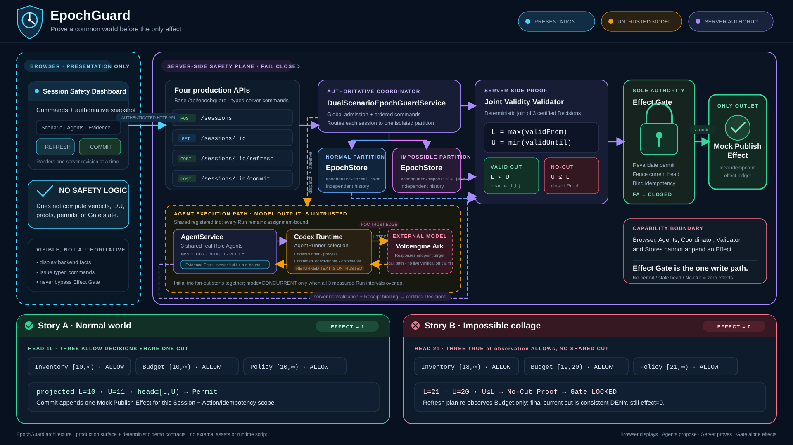
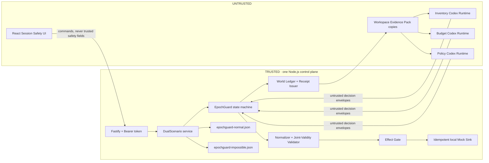

# EpochGuard

> **Every Agent can be right. The team can still act on a world that never
> existed.**

**Selected Track:** Track 1 — Multi-Agent Coordination Middleware

EpochGuard is a backend joint-validity effect gate for asynchronous Agent
teams. It binds three isolated Agent decisions to server-issued, versioned
observation receipts; blocks a protected effect when those observations cannot
coexist at one current world revision; produces a machine-checkable conflict
witness; and re-observes only the evidence owner that became invalid.

**中文摘要：** EpochGuard 检查多个 Agent 的证据是否曾在同一个当前世界版本中共同成立。若不存在共同切面，后端 Effect Gate 会拒绝副作用、给出可检验冲突证明，并只刷新已失效的证据 owner。

> [!IMPORTANT]
> **Release truth — 2026-08-30:** the deterministic WSL2 gate passes
> (`npm run check`: 361/361 server tests plus 6/6 web tests, typecheck, and
> production builds).
> The final candidate has **not yet completed the real Volcengine Ark/Codex
> lifecycle gate**. Controlled runners, HTTP fixtures, and the Mock Preview are
> not evidence of a real Ark run. Do not describe this project as live-Ark
> verified until the seven-run story below succeeds on the final candidate.

## The failure EpochGuard prevents

A campaign may be published only when inventory, budget, and policy all allow
the same immutable action. Each specialist can report a locally correct
`ALLOW`, yet their facts may form an impossible collage:

| Role Agent | Server-observed fact | Valid world interval | Verdict |
| --- | --- | --- | --- |
| Inventory | 1 unit is available | `[18, ∞)` | `ALLOW` |
| Budget | $8,000 remains | `[19, 20)` | `ALLOW` |
| Policy | publishing is permitted | `[21, ∞)` | `ALLOW` |

```text
L = max(18, 19, 21) = 21
U = min(∞, 20, ∞) = 20

A joint observed-world cut exists iff L < U.
21 < 20 is false, so the protected effect stays at 0.
```

Timestamps alone are insufficient: observations made at different wall-clock
times can still overlap, while individually truthful observations can have no
shared source revision. EpochGuard therefore validates authoritative half-open
version intervals at the effect boundary.

## What is innovative here

EpochGuard does not claim to invent interval intersection, MVCC, provenance,
or selective recomputation. Its hackathon contribution is their enforceable
combination around real Agent work:

- **Run-bound evidence:** a decision is accepted only when its server-issued
  Receipt, nonce, Role profile, Assignment, actual Run, action, query, and
  canonical Evidence Pack all match.
- **Joint validity as effect admission:** the model cannot publish. Only a
  backend Effect Gate can append the local Mock Effect after revalidating the
  current head and consuming a one-time Permit.
- **A checkable counterexample:** no-cut results retain `L`, `U`, the complete
  dependency-set hash, and the canonical Budget × Policy witness.
- **Conflict-directed recovery:** at head 21, only Budget is invalid. The
  system preserves Inventory and Policy, re-runs Budget once, and reaches the
  safe current decision `2 ALLOW + 1 DENY` with no release.
- **One authoritative evidence surface:** the Session Safety Dashboard renders
  one server-computed Snapshot. The browser does not calculate validity, choose
  refresh owners, issue Permits, or set effect counts.

## Two fixed demo worlds

| Scenario | Initial result | Authorized next step | Final effect |
| --- | --- | --- | ---: |
| **Normal World** | Three current `ALLOW` decisions at head 10 | Commit once; a repeated Commit returns the same Effect | 1 |
| **Impossible World** | Three local `ALLOW` decisions, but `L=21 ≥ U=20` | Re-observe **Budget only**; its current `$0` evidence yields `DENY` | 0 |

One complete product story performs **seven real Agent Runs**: three initial
Runs for Normal, three initial Runs for Impossible, and one Budget refresh.
The initial trios are dispatched concurrently; the UI reports
`CONCURRENT` only when their measured Run intervals actually overlap.

## Architecture and trust boundary

[](docs/assets/epochguard-architecture.svg)



Trusted code owns the logical clock, source history, Receipt records,
Assignment-to-Run binding, validation, refresh planning, Permit consumption,
and Mock Effect ledger. The browser, prompts, LLM output, and workspace files
are untrusted. The Ark key remains server-side but is available to an active
Runtime. See [Architecture](docs/ARCHITECTURE.md) and
[Security](SECURITY.md) for the complete boundary.

## Quick start — WSL2 + local process (recommended)

Use Ubuntu 24.04 in WSL2, Node.js 22+, npm 10+, and a **clean clone stored in
the WSL Linux filesystem** (for example under `~/src`). Do not reuse a Windows
checkout or its `node_modules`; run `npm ci` inside the WSL clone.

```bash
mkdir -p ~/src
cd ~/src
git clone --branch epochguard/staging --single-branch https://github.com/dong-runze/epochguard.git
cd epochguard
test "$(git branch --show-current)" = "epochguard/staging"
test -z "$(git status --short)"
export EPOCHGUARD_CANDIDATE_SHA="$(git rev-parse HEAD)"
test "$EPOCHGUARD_CANDIDATE_SHA" = "$(git rev-parse origin/epochguard/staging)"

npm ci
npm run check

npm install --global @openai/codex@0.111.0
export CODEX_BIN="$(npm prefix --global)/bin/codex"
"$CODEX_BIN" --version

# Stop here without a key: every deterministic release gate above is complete.
# Only a real Ark preflight and the seven product Runs remain credential-gated.
read -rsp "ARK_API_KEY: " ARK_API_KEY; echo
export ARK_API_KEY
read -rp "ARK_MODEL (Responses-capable endpoint/model ID): " ARK_MODEL
export ARK_MODEL
export ARK_BASE_URL="https://ark.cn-beijing.volces.com/api/v3"

case "$ARK_API_KEY" in ""|replace-*|*'<'*|*'>'*) echo "Real ARK_API_KEY required"; exit 2;; esac
case "$ARK_MODEL" in ""|*replace-*|*'<'*|*'>'*) echo "Real ARK_MODEL required"; exit 2;; esac
```

Until the real Ark gate passes and the reviewed candidate is promoted, the
repository's default `main` is intentionally still the Starter baseline. Clone
`epochguard/staging` explicitly as above; do not test the default branch yet.

Keep using the explicit `"$CODEX_BIN"` path for every later Codex command.
Do not replace it with `command -v codex` or bare `codex`: an inherited Windows
PATH can shadow the Linux global install with an incompatible Windows shim.

Before creating a demo Session, perform the disposable live credential smoke
in [the demo guide](docs/EPOCHGUARD_DEMO.md#3-live-credential-preflight-required).
It uses a scratch Codex home and does not write either scenario Store. A mere
`arkConfigured: true` flag confirms only non-placeholder configuration, not
that Ark accepted the key and model. The pinned Codex preflight passes only
when the CLI exits zero and its separately saved, trimmed final assistant
message exactly equals the expected marker; it never greps arbitrary JSONL
text for that marker.

After that smoke passes, create a **new data root for this entire seven-run
take** and start the development processes with explicit environment variables:

```bash
export EPOCHGUARD_DEMO_ROOT="$(mktemp -d /tmp/epochguard-demo.XXXXXX)"
export APP_DATA_DIR="$EPOCHGUARD_DEMO_ROOT/data"
export AGENT_WORKSPACE_ROOT="$EPOCHGUARD_DEMO_ROOT/workspaces"
export CODEX_HOME="$EPOCHGUARD_DEMO_ROOT/codex-home"
mkdir -p "$APP_DATA_DIR" "$AGENT_WORKSPACE_ROOT" "$CODEX_HOME"

export APP_AUTH_TOKEN="$(node -e 'process.stdout.write(require("node:crypto").randomBytes(24).toString("base64url"))')"
export NODE_ENV=development
export HOST=127.0.0.1
export PORT=3000
export RUNTIME_PROVIDER=local-process

# Optional: copy the browser token without printing it in a recording.
printf %s "$APP_AUTH_TOKEN" | clip.exe

npm run dev
```

Open <http://localhost:5173>, paste `APP_AUTH_TOKEN`, select **Session Safety**,
and use the exact UI buttons described in the [demo guide](docs/EPOCHGUARD_DEMO.md).
The UI automatically resolves the three fixed Role Agents and hides them from
the normal Agent Chat list; there is no manual Role selection step.

> [!CAUTION]
> `npm run dev` does **not** load `.env`; the server is plain `tsx watch` and
> reads only `process.env`. Export the variables in the same shell that starts
> it. Never click `Run Normal World` or `Run Impossible World` without a
> successful live credential preflight: Session creation returns `201` before
> background model execution, so missing or invalid Ark configuration later
> moves the Session to `FAILED` and consumes that scenario's fresh World.

## Container Runtime (WSL/Linux/macOS only)

`npm run poc` is a Bash script. Run it from WSL, Linux, or macOS—not native
PowerShell. It keeps the control plane on the host and starts each Agent turn
in a disposable Docker, Colima, or Podman container. Complete the live
credential preflight first, then use a new container data root:

```bash
export LOCAL_POC_DATA_ROOT="$(mktemp -d /tmp/epochguard-container.XXXXXX)"
export APP_AUTH_TOKEN="$(node -e 'process.stdout.write(require("node:crypto").randomBytes(24).toString("base64url"))')"
: "${ARK_API_KEY:?Run the hidden-input credential preflight first}"
: "${ARK_MODEL:?Run the credential preflight first}"
case "$ARK_API_KEY" in replace-*|*'<'*|*'>'*) echo "Real ARK_API_KEY required"; exit 2;; esac
case "$ARK_MODEL" in *replace-*|*'<'*|*'>'*) echo "Real ARK_MODEL required"; exit 2;; esac
export ARK_BASE_URL="https://ark.cn-beijing.volces.com/api/v3"
npm run poc
```

Open <http://localhost:3000>. The script builds `Dockerfile.runtime`, selects a
supported engine, and sets `RUNTIME_PROVIDER=container`. Docker/Podman
availability is a separate release gate and has not been established by the
deterministic test suite.

For Docker Compose, `.env` is consumed by Compose, but production binds to
`0.0.0.0` and rejects a missing, placeholder, or short token. Generate a 32
character URL-safe value with the Node command above and set all three of
`ARK_API_KEY`, `ARK_MODEL`, and `APP_AUTH_TOKEN` before
`docker compose up --build`. Do not rely only on the current
`bootstrap-local.sh` reminder.

## Three-minute judge walkthrough

The recorded submission should be a truthful **edited/accelerated capture** of
the real seven-Run story, not a promise that seven live model calls finish
unedited within three minutes:

1. Show the candidate revision, live credential preflight, and a new demo data
   root without exposing secrets.
2. Click `Run Normal World`; show three real Run IDs and `READY`, then click
   `Commit protected effect` and show `Effects in this session: 1`.
3. Click `Clear saved session`, switch to Impossible, and click
   `Run Impossible World`.
4. Keep all three `ALLOW` cards visible while the server reports
   `NO VALID OBSERVED-WORLD CUT`, `L=21`, `U=20`, the Budget × Policy witness,
   and effect count 0.
5. Click `Re-observe Budget only`; show only Budget's second Run, final
   `CONSISTENT_DENY`, counts `1/2/1`, two reruns avoided, and effect count 0.

Label cuts or speed-ups, preserve real Run/Assignment/Receipt IDs and elapsed
times, and never substitute the Mock Preview. A detailed shot list is in
[Reproducible demo](docs/EPOCHGUARD_DEMO.md#7-recording-a-truthful-three-minute-video).

## Reproducibility traps

- A full rehearsal or recording take gets one newly created data root. Both
  `epochguard-normal.json` and `epochguard-impossible.json` must begin pristine.
- `Clear saved session` clears only the browser's saved pointer after a terminal
  Session. It does not rewind the backend World.
- Re-running the same scenario in the same data root returns `UNSTABLE_WORLD`.
  Stop the app and create a new root; do not edit or delete Store contents to
  manufacture a reset.
- Normal and Impossible are separate backend partitions coordinated by
  `DualScenarioEpochGuardService`; there is no production
  `data/epochguard.json` file.

## Test evidence

| Evidence | Current result | What it proves | What it does **not** prove |
| --- | --- | --- | --- |
| Windows and WSL2 Ubuntu 24.04 clean clones: `npm run check` | **PASS** — Server 23 files / 361 tests; Web 1 file / 6 tests; Server/Web typecheck; Web/Server production builds | Contracts, Stores, interval validation, no-cut proof, run binding, selective refresh, Effect Gate, routes, dual-scenario integration, Snapshot projection, and fail-closed Runtime readiness under deterministic tests | Ark credentials, remote model behavior, Docker daemon, or an end-to-end live recording |
| Controlled-HTTP browser gate recorded for the integrated production shell | **PASS**, documented in the two authoritative design/workflow records | Production routing, authentication boundary, single-Snapshot UI, and fail-closed browser behavior under controlled responses | A real Ark/Codex lifecycle |
| Final-candidate real Ark seven-Run story | **NOT COMPLETED / NOT PASSED** | Required before the release claim can be upgraded | Nothing yet; this is the open release gate |

Run the deterministic gate yourself:

```bash
npm run check
```

The real Ark smoke and seven-Run story are intentionally separate and are not
part of the default offline test command.

## Limits and honest claims

- The MVP supports exactly three fixed Roles, two deterministic fixtures, one
  campaign action shape, and one explicit Budget refresh round.
- The strong guarantee covers only effects routed exclusively through the local
  EpochGuard Effect Gate and its local Mock Sink. It is not a distributed
  transaction or a claim about arbitrary external APIs.
- Exactly-once behavior is scoped to the same Session + Action in one process;
  it is not cross-Session business deduplication.
- The two JSON scenario Stores use single-process serialized writes. They do not
  support multiple Node writers or shared multi-replica deployment, and updates
  across the two files are not a cross-file transaction.
- A Receipt proves server-side binding to stored source history; it does not
  prove that the physical world or source is honest, or that the LLM's semantic
  reasoning is correct.
- The central `world_seq` works only for registered comparable sources.
  Unverifiable history and incomparable clocks fail closed.
- `APP_AUTH_TOKEN` is a shared demo bearer token, not identity, RBAC, or tenant
  authorization. There is no CSRF protection or hardened multi-tenant sandbox.
- Agent Runtimes receive the scoped Ark key and have outbound network access.
  Use revocable demo credentials and no production data.
- The Dashboard is an evidence surface, not the safety boundary. The Mock
  Preview is labeled and is never release evidence.

See [Security](SECURITY.md) for the Starter's broader POC limitations.

## Documentation

- [Reproducible demo and recording runbook](docs/EPOCHGUARD_DEMO.md)
- [Architecture and trust boundaries](docs/ARCHITECTURE.md)
- [Authoritative EpochGuard final design](docs/EPOCHGUARD_FINAL_DESIGN.md)
- [Authoritative implementation and release workflow](docs/EPOCHGUARD_PARALLEL_SESSION_WORKFLOW.md)
- [Local container POC details](docs/LOCAL_POC.md)
- [Security policy](SECURITY.md)
- [License](LICENSE)

---

EpochGuard does not ask only, “Who may act?” It asks, “Which observed world is
this team acting on?”

**No valid observed world. No side effect.**
