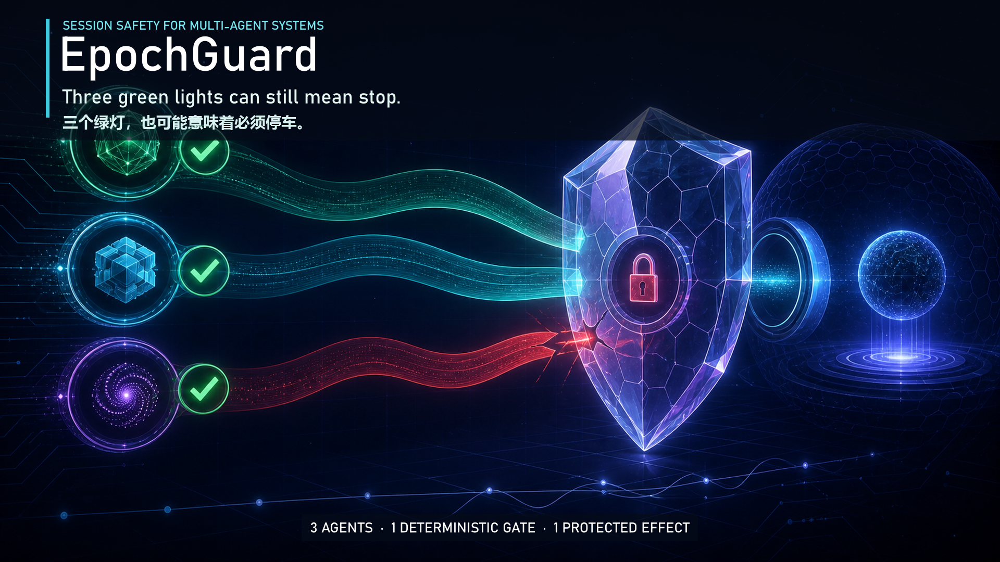
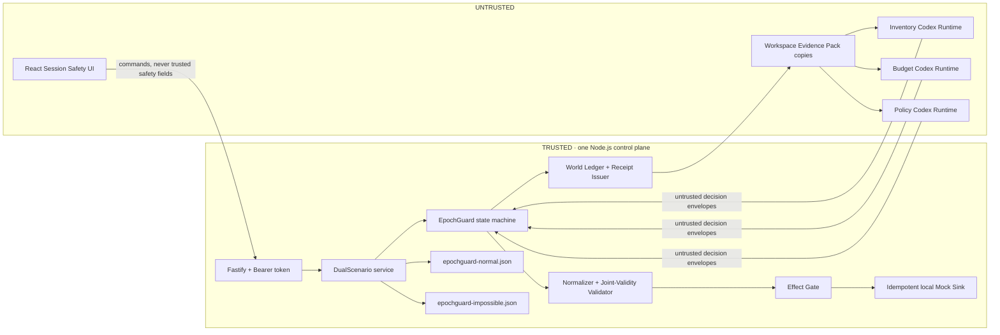

# EpochGuard

> **Every Agent can be right. The team can still act on a world that never
> existed.**

**Selected Track:** Track 1 — Multi-Agent Coordination Middleware

EpochGuard is a backend joint-validity effect gate for asynchronous Agent
teams. It binds three isolated Agent decisions to server-issued, versioned
observation receipts; blocks a protected effect when those observations cannot
coexist at one current world revision; produces a machine-checkable conflict
witness; and re-observes only the evidence owner that became invalid.

**中文摘要：** EpochGuard 检查多个 Agent 的证据是否曾在同一个当前世界版本中共同成立。若不存在共同切面，后端 Effect Gate 会拒绝副作用、给出可检验冲突证明，并只刷新已失效的证据 owner。

## Judge quick start — choose your depth

### 1. Watch the result (47 seconds)

[](docs/assets/epochguard-demo-submission.mp4)

**[Watch or download the submission video](docs/assets/epochguard-demo-submission.mp4)**
— 1080p H.264, bilingual hard subtitles, 7.4 MiB, intentionally silent.
The implementation shown in the video is public at commit
[`d27713c`](https://github.com/dong-runze/epochguard/commit/d27713c92f677cd02d869ebc3bd58cc4119cd6d4)
(`volc-agent-launchpad` version `1.0.0`).

### 2. Explore the UI locally — no token, key, backend, WSL, or Docker

Requirements: Git, npm 10+, and Node.js **22.12.0 or newer**. This path works
from Windows PowerShell, WSL, Linux, or macOS.

```bash
git clone --branch epochguard/staging --single-branch https://github.com/dong-runze/epochguard.git
cd epochguard
npm ci
npm run dev -w @launchpad/web -- --host 127.0.0.1 --strictPort
```

Open <http://127.0.0.1:5173/epochguard-preview.html>. The page lets a reviewer
switch among the Normal released state, the Impossible blocked state, selective
Budget refresh, and failure states. It is deliberately labeled as a
network-free contract-fixture **visual preview**, not evidence of live Agent
execution.

### 3. Verify the implementation offline — no token or key

From the same clone:

```bash
npm run check
```

This runs the Server/Web typechecks, deterministic tests, and production
builds. `APP_AUTH_TOKEN` and `ARK_API_KEY` are needed only for the full live
path below. `APP_AUTH_TOKEN` is a random access password that **you generate
locally for this app**; it is not a TikTok, GitHub, or ModelArk credential.
`ARK_API_KEY` is the BytePlus ModelArk credential used only for real model
inference.

For the complete seven-Run Agent lifecycle, continue with
[Full live Agent run](#full-live-agent-run--wsl2--local-process-recommended).

> [!IMPORTANT]
> **Evidence boundary:** on 2026-08-30, a pre-freeze WSL2 working-tree snapshot
> passed its then-current `npm run check`, a scratch Responses/Codex preflight,
> and one complete seven-Run API story against BytePlus ModelArk
> `seed-2-0-lite-260428`. That historical result does not certify the checkout
> you are reading. A release is `GO` only when one exact clean public commit
> passes the offline, live, browser, repeatability, privacy, and link gates in
> the [demo runbook](docs/EPOCHGUARD_DEMO.md). Its SHA and results belong in the
> external sanitized release manifest; this repository does not pre-claim them.

## The failure EpochGuard prevents

A campaign may be published only when inventory, budget, and policy all allow
the same immutable action. Each specialist can report a locally correct
`ALLOW`, yet their facts may form an impossible collage:

| Role Agent | Server-observed fact | Valid world interval | Verdict |
| --- | --- | --- | --- |
| Inventory | 1 unit is available | `[18, ∞)` | `ALLOW` |
| Budget | $8,000 remains | `[19, 20)` | `ALLOW` |
| Policy | publishing is permitted | `[21, ∞)` | `ALLOW` |

```text
L = max(18, 19, 21) = 21
U = min(∞, 20, ∞) = 20

A joint observed-world cut exists iff L < U.
21 < 20 is false, so the protected effect stays at 0.
```

Timestamps alone are insufficient: observations made at different wall-clock
times can still overlap, while individually truthful observations can have no
shared source revision. EpochGuard therefore validates authoritative half-open
version intervals at the effect boundary.

## What is innovative here

EpochGuard does not claim to invent interval intersection, MVCC, provenance,
or selective recomputation. Its hackathon contribution is their enforceable
combination around real Agent work:

- **Run-bound evidence:** a decision is accepted only when its server-issued
  Receipt, nonce, Role profile, Assignment, actual Run, action, query, and
  canonical Evidence Pack all match.
- **Authoritative fixed-rule verification:** model Verdicts are untrusted
  proposals. The backend recomputes the three fixed Role results from the
  canonical Action and authoritative ResourceVersion before issuing a Permit,
  and the Effect Gate repeats that check immediately before release.
- **Joint validity as effect admission:** the model cannot publish. Only a
  backend Effect Gate can append the local Mock Effect after revalidating the
  current head and consuming a one-time Permit.
- **A checkable counterexample:** no-cut results retain `L`, `U`, the complete
  dependency-set hash, and the canonical Budget × Policy witness.
- **Conflict-directed recovery:** at head 21, only Budget is invalid. The
  system preserves Inventory and Policy, re-runs Budget once, and reaches the
  safe current decision `2 ALLOW + 1 DENY` with no release.
- **One authoritative evidence surface:** the Session Safety Dashboard renders
  one server-computed Snapshot. The browser does not calculate validity, choose
  refresh owners, issue Permits, or set effect counts.

## Two fixed demo worlds

| Scenario | Initial result | Authorized next step | Final effect |
| --- | --- | --- | ---: |
| **Normal World** | Three current `ALLOW` decisions at head 10 | Commit once; a repeated Commit returns the same Effect | 1 |
| **Impossible World** | Three local `ALLOW` decisions, but `L=21 ≥ U=20` | Re-observe **Budget only**; its current `$0` evidence yields `DENY` | 0 |

One complete product story performs **seven real Agent Runs**: three initial
Runs for Normal, three initial Runs for Impossible, and one Budget refresh.
The initial trios are dispatched concurrently; the UI reports
`CONCURRENT` only when their measured Run intervals actually overlap.

## Architecture and trust boundary

[](docs/assets/epochguard-architecture.svg)



Trusted code owns the logical clock, source history, Receipt records,
Assignment-to-Run binding, validation, refresh planning, Permit consumption,
and Mock Effect ledger. The browser, prompts, LLM output, and workspace files
are untrusted. The Ark key remains server-side but is available to an active
Runtime. See [Architecture](docs/ARCHITECTURE.md) and
[Security](SECURITY.md) for the complete boundary.

## Full live Agent run — WSL2 + local process (recommended)

Use Ubuntu 24.04 in WSL2, Node.js 22.12.0+, npm 10+, and a **clean clone stored in
the WSL Linux filesystem** (for example under `~/src`). Do not reuse a Windows
checkout or its `node_modules`; run `npm ci` inside the WSL clone.

```bash
mkdir -p ~/src
cd ~/src
git clone --branch epochguard/staging --single-branch https://github.com/dong-runze/epochguard.git
cd epochguard
test "$(git branch --show-current)" = "epochguard/staging"
test -z "$(git status --short)"
export EPOCHGUARD_CANDIDATE_SHA="$(git rev-parse HEAD)"
test "$EPOCHGUARD_CANDIDATE_SHA" = "$(git rev-parse origin/epochguard/staging)"

npm ci
npm run check

npm install --global @openai/codex@0.111.0
export CODEX_BIN="$(npm prefix --global)/bin/codex"
"$CODEX_BIN" --version

# Stop here without a key: every deterministic release gate above is complete.
# Credentials are required only for the live preflight and seven product Runs.
read -rsp "ARK_API_KEY: " ARK_API_KEY; echo
export ARK_API_KEY
read -rp "ARK_MODEL (Responses-capable endpoint/model ID): " ARK_MODEL
export ARK_MODEL
# Verified BytePlus AP/Johor data-plane route.
export ARK_BASE_URL="https://ark.ap-southeast.bytepluses.com/api/v3"

case "$ARK_API_KEY" in ""|replace-*|*'<'*|*'>'*) echo "Real ARK_API_KEY required"; exit 2;; esac
case "$ARK_MODEL" in ""|*replace-*|*'<'*|*'>'*) echo "Real ARK_MODEL required"; exit 2;; esac
```

The public candidate reference for this protocol is `epochguard/staging`; the
older default `main` branch is not a release identity. Devpost, the external
manifest, and reviewer commands must name that public branch and its exact SHA.
If the team later publishes an immutable submission tag or promotes the default
branch, update every public link together and repeat the same-SHA release gates.

Keep using the explicit `"$CODEX_BIN"` path for every later Codex command.
Do not replace it with `command -v codex` or bare `codex`: an inherited Windows
PATH can shadow the Linux global install with an incompatible Windows shim.

Before creating a demo Session, perform the disposable live credential smoke
in [the demo guide](docs/EPOCHGUARD_DEMO.md#3-live-credential-preflight-required).
It uses a scratch Codex home and does not write either scenario Store. A mere
`arkConfigured: true` flag confirms only non-placeholder configuration, not
that Ark accepted the key and model. The pinned Codex preflight passes only
when the CLI exits zero and its separately saved, trimmed final assistant
message exactly equals the expected marker; it never greps arbitrary JSONL
text for that marker.

After that smoke passes, create a **new data root for this entire seven-run
take** and start the development processes with explicit environment variables:

```bash
export EPOCHGUARD_DEMO_ROOT="$(mktemp -d /tmp/epochguard-demo.XXXXXX)"
export APP_DATA_DIR="$EPOCHGUARD_DEMO_ROOT/data"
export AGENT_WORKSPACE_ROOT="$EPOCHGUARD_DEMO_ROOT/workspaces"
export CODEX_HOME="$EPOCHGUARD_DEMO_ROOT/codex-home"
mkdir -p "$APP_DATA_DIR" "$AGENT_WORKSPACE_ROOT" "$CODEX_HOME"

export APP_AUTH_TOKEN="$(node -e 'process.stdout.write(require("node:crypto").randomBytes(24).toString("base64url"))')"
export NODE_ENV=development
export HOST=127.0.0.1
export PORT=3000
export RUNTIME_PROVIDER=local-process

# Optional: copy the browser token without printing it in a recording.
printf %s "$APP_AUTH_TOKEN" | clip.exe

npm run dev
```

Open <http://localhost:5173>, paste `APP_AUTH_TOKEN`, and select **Session
Safety** inside the Playground. Before a Session starts, its launcher displays
the three exact protected Role Agent names and lifecycle states. Click a Role
card to focus that real Agent's read-only ID and fixed-profile inspection. This
focus is not owner assignment: the frontend still resolves all three fixed
Agents by exact name and cannot substitute their IDs. They remain hidden from
ordinary Agent Chat so an operator cannot mutate, stop, delete, or manually
prompt them. Use the exact UI sequence in the [demo guide](docs/EPOCHGUARD_DEMO.md).

> [!CAUTION]
> `npm run dev` does **not** load `.env`; the server is plain `tsx watch` and
> reads only `process.env`. Export the variables in the same shell that starts
> it. Never click `Run Normal World` or `Run Impossible World` without a
> successful live credential preflight: Session creation returns `201` before
> background model execution, so missing or invalid Ark configuration later
> moves the Session to `FAILED` and consumes that scenario's fresh World.

## Container Runtime (WSL/Linux/macOS only)

`npm run poc` is a Bash script. Run it from WSL, Linux, or macOS—not native
PowerShell. It keeps the control plane on the host and starts each Agent turn
in a disposable Docker, Colima, or Podman container. Complete the live
credential preflight first, then use a new container data root:

```bash
export LOCAL_POC_DATA_ROOT="$(mktemp -d /tmp/epochguard-container.XXXXXX)"
export APP_AUTH_TOKEN="$(node -e 'process.stdout.write(require("node:crypto").randomBytes(24).toString("base64url"))')"
: "${ARK_API_KEY:?Run the hidden-input credential preflight first}"
: "${ARK_MODEL:?Run the credential preflight first}"
case "$ARK_API_KEY" in replace-*|*'<'*|*'>'*) echo "Real ARK_API_KEY required"; exit 2;; esac
case "$ARK_MODEL" in *replace-*|*'<'*|*'>'*) echo "Real ARK_MODEL required"; exit 2;; esac
export ARK_BASE_URL="https://ark.ap-southeast.bytepluses.com/api/v3"
npm run poc
```

Open <http://localhost:3000>. The script builds `Dockerfile.runtime`, selects a
supported engine, and sets `RUNTIME_PROVIDER=container`. Docker/Podman
availability is a separate release gate and has not been established by the
deterministic test suite.

For Docker Compose, `.env` is consumed by Compose, but production binds to
`0.0.0.0` and rejects a missing, placeholder, or short token. Generate a 32
character URL-safe value with the Node command above and set all three of
`ARK_API_KEY`, `ARK_MODEL`, and `APP_AUTH_TOKEN` before
`docker compose up --build`. Do not rely only on the current
`bootstrap-local.sh` reminder.

## Three-minute judge walkthrough

The formal submission is one campaign-publish safety story with two controlled
fixture states: Normal is the healthy control; Impossible is the temporal
conflict and recovery branch. The Dashboard is the evidence surface, while the
claimed middleware executes in the trusted server/Runtime/data/Effect path.

The recorded submission should be a truthful **edited/accelerated capture** of
the real seven-Run story, not a promise that seven live model calls finish
unedited within three minutes:

1. Show one public, clean candidate revision plus sanitized offline/preflight
   pass badges without exposing secrets.
2. Start inside the Playground on the Session Safety launcher. Focus the Budget
   Role card and show its real Agent name, ID, lifecycle, and fixed profile while
   all three remain `ready`. The focus must not alter the server-frozen trio.
3. Click `Run Normal World`, then follow the same Budget Role into its actual
   Run-bound evidence while showing all three real Runs. Show `READY`, click
   `Commit protected effect`, and capture effect count 1.
4. Click `Clear saved session`, switch to Impossible, and click
   `Run Impossible World`.
5. Keep all three `ALLOW` cards visible while the server reports
   `NO VALID OBSERVED-WORLD CUT`, `L=21`, `U=20`, the Budget × Policy witness,
   and effect count 0.
6. Click `Re-observe Budget only`; show only Budget's second Run, final
   `CONSISTENT_DENY`, counts `1/2/1`, two reruns avoided, and effect count 0.

Label cuts or speed-ups, preserve real Run/Assignment/Receipt IDs and elapsed
times, and never substitute the Mock Preview. A detailed shot list is in
[Reproducible demo](docs/EPOCHGUARD_DEMO.md#7-execute-the-formal-demo-and-produce-the-submission-video).

> [!WARNING]
> **Do not infer release status from this README.** A dirty tree, a historical
> pass, an API-only run, or the presence of the Agent-focus UI is not Formal Demo
> `GO`. Freeze and publish one reviewed commit, then record every required gate
> against that unchanged SHA in the external sanitized release manifest. Any
> code or documentation change starts that evidence chain again.

## Reproducibility traps

- A full rehearsal or recording take gets one newly created data root. Both
  `epochguard-normal.json` and `epochguard-impossible.json` must begin pristine.
- `Clear saved session` clears only the browser's saved pointer after a terminal
  Session. It does not rewind the backend World.
- Re-running the same scenario in the same data root returns `UNSTABLE_WORLD`.
  Stop the app and create a new root; do not edit or delete Store contents to
  manufacture a reset.
- Normal and Impossible are separate backend partitions coordinated by
  `DualScenarioEpochGuardService`; there is no production
  `data/epochguard.json` file.

## Test evidence

| Evidence | Recorded result | What it proves | What it does **not** prove |
| --- | --- | --- | --- |
| Pre-freeze WSL2 working-tree snapshot (2026-08-30): then-current `npm run check` | **HISTORICAL PASS** — all Server/Web tests, typechecks, and production builds in that snapshot passed | Contracts, Stores, interval validation, no-cut proof, run binding, selective refresh, Effect Gate, routes, dual-scenario integration, Snapshot projection, and fail-closed Runtime readiness at that revision | The later authoritative fixed-rule Verdict recomputation, public candidate, Agent-focus UI, remote-model repeatability, or a finished video |
| Earlier controlled-HTTP browser gate | **HISTORICAL PASS** on the recorded pre-focus candidate | Production routing, authentication boundary, single-Snapshot UI, and fail-closed browser behavior under controlled responses at that revision | The final Agent-focus UI or a real ModelArk/Codex lifecycle |
| Pre-freeze ModelArk/Codex seven-Run API story (`seed-2-0-lite-260428`) | **HISTORICAL PASS ONCE** — Normal `3 ALLOW`, effective joint-validation window `[10,11)` at head 10, one idempotent Effect; Impossible `L=21/U=20`, Budget-only refresh, final `2 ALLOW + 1 DENY`, counts `1/2/1`, zero Effects | That configuration, then-current prompt/validation logic, Runtime, real Agent outputs, selective refresh, and Effect Gate worked together once | Strict `epoch-prompt-v2`, the later authoritative fixed-rule Verdict recomputation, the exact public candidate, repeated stability, the browser journey, or the submission video |
| Public implementation shown in the submission video (`d27713c`) | **PUBLIC SOURCE IDENTITY** — inspect the linked immutable commit and the repository-hosted video above | Exactly identifies the application source shown in the submitted demo | It does not turn a prerecorded run into a hosted live service or replace a reviewer's own credentialed rerun |

Strict `epoch-prompt-v2` and authoritative fixed-rule Verdict recomputation are
current-candidate capabilities, not facts inherited from either historical row.
They remain pending the exact public fresh-clone check, same-SHA live preflight,
and browser release gates recorded in the external sanitized manifest.

Run the deterministic gate yourself:

```bash
npm run check
```

The real Ark smoke and seven-Run story are intentionally separate and are not
part of the default offline test command.

## Reviewer access

The offline install, deterministic tests, typechecks, and production builds are
free to run and require no ModelArk credential:

```bash
npm ci
npm run check
```

This repository does **not** claim that a public hosted live-model service
already exists. A reviewer who chooses to repeat the real Agent path needs
either their own eligible BytePlus ModelArk AP account and API key, or temporary
access arranged by the organizers/team outside the public repository. BytePlus
publishes a [free-token offer](https://docs.byteplus.com/en/docs/modelark/1399514)
for eligible accounts, but availability and terms are controlled by BytePlus
and are not guaranteed by EpochGuard. Never share or commit a ModelArk API key.

If a temporary hosted reviewer endpoint is later listed in Devpost, it may
provide only a revocable application access token; the ModelArk key remains on
the server. The [repository-hosted submission video](docs/assets/epochguard-demo-submission.mp4)
is evidence of the recorded execution, not a substitute for credentials or a
claim of current hosted availability.

## Third-party technology and assets

| Item | Use and attribution |
| --- | --- |
| TikTok TechJam Agent Launchpad Starter Kit | The supplied baseline at commit `8d0bd4f` provides the original React/Node Agent CRUD, Playground, Runtime adapters, deployment templates, and `docs/assets/create-agent.jpg` / `playground.jpg` reference images. It is distributed under the repository's [MIT License](LICENSE). |
| BytePlus ModelArk | External OpenAI-compatible Responses API used for model inference through the AP/Johor data plane. It is not bundled; BytePlus account, regional key/model access, and [BytePlus terms](https://www.byteplus.com/en/terms) apply. |
| OpenAI Codex CLI | Separately installed Agent runtime (`@openai/codex@0.111.0` for the recorded protocol). It is not vendored; see the [upstream project and license](https://github.com/openai/codex). |
| React, React DOM, Vite, `@vitejs/plugin-react` | Browser UI and production bundle; each is MIT-licensed. |
| Fastify, `@fastify/cors`, `@fastify/static` | HTTP API, CORS, and single-port static production serving; each is MIT-licensed. |
| Zod | Runtime configuration and contract validation; MIT-licensed. |
| TypeScript, tsx, Vitest, concurrently | Build, development, orchestration, and deterministic tests. TypeScript is Apache-2.0; the other three are MIT-licensed. Exact packages, versions, integrity hashes, and dependency licenses are inspectable from [`package-lock.json`](package-lock.json) and the installed package metadata. |
| EpochGuard visual assets | `docs/assets/epochguard-architecture.svg`, `docs/assets/epochguard-demo-cover.png`, the EpochGuard UI styling, and the silent bilingual submission video are project-created. No third-party music or stock media is used. |

## Limits and honest claims

- The MVP supports exactly three fixed Roles, two deterministic fixtures, one
  campaign action shape, and one explicit Budget refresh round.
- The strong guarantee covers only effects routed exclusively through the local
  EpochGuard Effect Gate and its local Mock Sink. It is not a distributed
  transaction or a claim about arbitrary external APIs.
- Exactly-once behavior is scoped to the same Session + Action in one process;
  it is not cross-Session business deduplication.
- The two JSON scenario Stores use single-process serialized writes. They do not
  support multiple Node writers or shared multi-replica deployment, and updates
  across the two files are not a cross-file transaction.
- A Receipt alone does not prove source truth or LLM reasoning. For the three
  fixed MVP rules, the backend independently recomputes the result from the
  authoritative Action and ResourceVersion and fails closed on any mismatch.
- The central `world_seq` works only for registered comparable sources.
  Unverifiable history and incomparable clocks fail closed.
- `APP_AUTH_TOKEN` is a shared demo bearer token, not identity, RBAC, or tenant
  authorization. There is no CSRF protection or hardened multi-tenant sandbox.
- Agent Runtimes receive the scoped Ark key and have outbound network access.
  Use revocable demo credentials and no production data.
- The Dashboard is an evidence surface, not the safety boundary. The Mock
  Preview is labeled and is never release evidence.

See [Security](SECURITY.md) for the Starter's broader POC limitations.

## English reviewer documentation

- [Reproducible demo and recording runbook](docs/EPOCHGUARD_DEMO.md)
- [Architecture and trust boundaries](docs/ARCHITECTURE.md)
- [Local container POC details](docs/LOCAL_POC.md)
- [Security policy](SECURITY.md)
- [License](LICENSE)

Internal planning records are retained for provenance but are written in
Chinese and are **not submission instructions**: [detailed design](docs/EPOCHGUARD_FINAL_DESIGN.md)
and [parallel implementation workflow](docs/EPOCHGUARD_PARALLEL_SESSION_WORKFLOW.md).
The English README, architecture, security policy, and demo runbook are the
judge-facing sources of truth.

---

EpochGuard does not ask only, “Who may act?” It asks, “Which observed world is
this team acting on?”

**No valid observed world. No side effect.**
