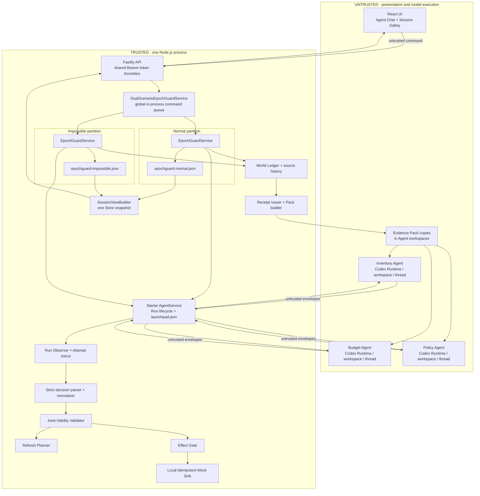
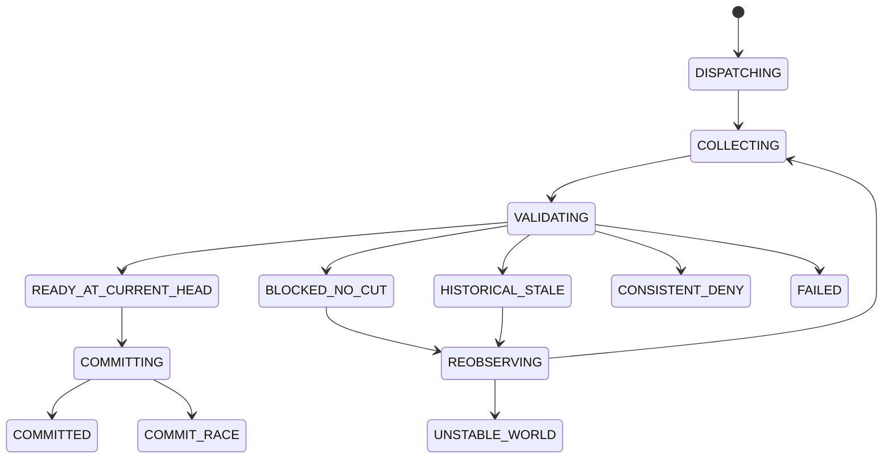

# EpochGuard Architecture

EpochGuard is a single-node, backend coordination middleware for one fixed
three-Agent decision protocol. It extends the Starter's React/Fastify/Codex
path without trusting the browser or the model to make a safety decision.

Its release invariant is deliberately narrow:

> For effects routed exclusively through EpochGuard, no effect is released
> unless every server-issued, Assignment-bound observation Receipt is bound to
> the same action and its actual Run, all three authoritative intervals cover
> one current observed-world head, every submitted Role verdict equals the
> backend's fixed authoritative-rule result, all three results are `ALLOW`, and
> the local Sink's freshness and idempotency checks pass.

This is not a claim about arbitrary tools, external sinks, physical-world
truth, arbitrary/open-ended semantic verification, the model's internal
reasoning or `reason` text, distributed transactions, or exactly-once delivery
across systems.

## System view



There are two `EpochGuardService` instances and two independent `EpochStore`
files. `DualScenarioEpochGuardService` routes the fixed scenario ID to the
correct partition, checks that both Stores agree on the three Role identities,
and serializes create/refresh/commit commands through one process-local queue.
It does **not** provide a transaction spanning the two JSON files.

Both partitions share the same three dedicated Role Agents:

| Role | Fixed Agent identity | Dynamic evidence | Forbidden domain/capability |
| --- | --- | --- | --- |
| Inventory | `EpochGuard Inventory Agent` | available units for `campaign_42` | Budget, Policy, Publish |
| Budget | `EpochGuard Budget Agent` | remaining budget for `campaign_42` | Inventory, Policy, Publish |
| Policy | `EpochGuard Policy Agent` | permission for market `SG` | Inventory, Budget, Publish |

Startup creates missing Role Agents, freezes each Role profile version and
actual `AGENTS.md` digest, and copies the registration identity into the other
pristine scenario Store. The UI resolves these Agents by exact name and hides
them from the ordinary Agent Chat list. Before a Session, each real Role Agent
is a read-only focus button exposing its actual ID, lifecycle, and expected
fixed-profile summary. Focus changes only the inspection panel: all three owner
IDs are still resolved independently and the create command cannot contain a
focused Role. During the Run, the server requires each Snapshot Agent and its
Run-bound evidence to preserve the same frozen Agent ID and assigned name. The
API also blocks edit, delete, start, stop, and chat operations against those
IDs. Each dispatch and accepted output re-checks the frozen profile and on-disk
digest.

## End-to-end protocol

### 1. Create returns before model completion

`POST /api/epochguard/sessions` validates the registered scenario and the
browser-supplied Role IDs. The browser cannot submit action fields, source
history, world heads, Receipts, Permits, or effect values.

The selected partition then:

1. requires a pristine World ledger;
2. constructs the immutable `PUBLISH_CAMPAIGN` action and canonical hash;
3. applies the fixed World commits and captures observations at their declared
   heads;
4. creates one Assignment, Attempt, server Receipt, and canonical Evidence Pack
   per Role;
5. persists state `DISPATCHING`; and
6. returns an authoritative `201` Snapshot.

Writing Packs, starting Codex, polling Runs, parsing output, and validation
continue in a service-owned background task. Therefore `201` means only that
the Session was admitted and persisted. It does not mean that Ark accepted a
request or that the Session passed. Missing or invalid Ark credentials can
turn this already-created Session into `FAILED`, which is why a disposable
live credential preflight is required before either Run button is clicked.

### 2. Deterministic source capture

Normal uses one commit at head 10 and captures all three source versions while
they remain open:

```text
Inventory [10, ∞)  Budget [10, ∞)  Policy [10, ∞)
```

Impossible deliberately interleaves commit and capture:

```text
v18 Inventory=1       -> capture Inventory
v19 Budget=$8,000     -> capture Budget
v20 Budget=$0
v21 Policy=permitted  -> capture Policy
```

The old Budget value is captured while it is authoritative; it is not invented
at head 21. Source versions use half-open intervals, so the initial evidence is
`[18,∞)`, `[19,20)`, and `[21,∞)`.

### 3. Assignment-scoped model work

The server writes one canonical Pack to a path shaped like:

```text
.epochguard/sessions/<sessionId>/<role>/<assignmentId>.json
```

The prompt contains the relative path, Assignment ID, and strict response
format. Dynamic business values, Receipt ID, and nonce live in the Pack. The
three initial `dispatchBindPoll` operations are created before the service
awaits their settled results. The service records `CONCURRENT` only if the
actual Run time intervals overlap; otherwise it records
`SEQUENTIAL_FALLBACK`.

Each model response is untrusted. The parser accepts exactly one
`<EPOCH_DECISION>{...}</EPOCH_DECISION>` envelope, no trailing text, no extra
fields, and at most 16 KiB. The normalizer checks:

```text
Session + Action + Role + Agent + profile digest
+ Assignment + actual bound Run + Receipt + nonce
+ query hash + canonical Pack hash + one-time consumption
```

The model never supplies a trusted `runId`, interval, Permit, or Sink argument.
The normalized Verdict remains an untrusted candidate. In the same Store
transaction, the validator resolves the Receipt's authoritative
ResourceVersion and calls the fixed `evaluateAuthoritativeVerdict(role, action,
resourceValue)` predicate. A mismatch is `DECISION_INVALID`; the candidate
Decision, JVC, Permit, and Effect are not published. The Evidence Pack's natural
language `decisionRule` is model guidance, not an interpreted policy DSL.

### 4. Joint validity and current-head readiness

For each Receipt interval `Ii = [from_i, until_i)`, the validator computes:

```text
L = max(from_i)
U = min(until_i)

historical joint validity: L < U
current readiness: every interval contains current head H
```

The result is one of:

- `VALID_CURRENT_ALLOW`: all evidence covers `H`, every submitted Verdict
  matches the authoritative fixed-rule result, and all three are `ALLOW`;
- `CONSISTENT_DENY`: evidence is current and at least one authoritative result
  is `DENY`, with every submitted Verdict matching its result;
- `NO_VALID_OBSERVED_WORLD_CUT`: `L >= U`, with a persisted proof and canonical
  latest-start/earliest-end witness;
- `HISTORICAL_BUT_STALE_NOW`: a historical intersection exists but does not
  cover the current head; or
- fail closed when any source history or binding is unverifiable.

The browser receives this as one server-built `SessionDashboardSnapshot`; it
does not independently join Runs, source versions, validations, and Effects.

### 5. Protected commit

For a current all-ALLOW result, the service issues a one-time Permit bound to:

```text
Session + actionHash + dependencySetHash
+ JointValidityCertificate + validatedHead + idempotencyKey
```

`POST /commit` contains only `expectedSessionRevision`. Inside one
`EpochStore.mutate()` critical section, the Effect Gate rechecks the active
Decisions, Assignment/Run closure, Receipts and source intervals, dependency
hash, current head, Permit, idempotency key, and all three fixed authoritative
rule results. It requires both each active Decision and each recomputed result
to be `ALLOW`, then appends one local Effect and consumes the Permit in the same
atomic JSON replacement. A repeated or concurrent Commit for the same
Session + Action returns the existing Effect.

If the head advances after validation, the Session terminates as
`COMMIT_RACE`, keeps effect count zero, and does not auto-replay.

### 6. Selective re-observation

For a no-cut or historical-stale result, the server computes:

```text
refreshSet(H) = { evidence owner whose Receipt does not cover H }
```

In the fixed Impossible fixture at head 21, only Budget is invalid. The
one-time RefreshPlan is bound to the Session revision, head, dependency set,
and active Decision IDs. `POST /refresh` accepts only the expected Session
revision and plan ID; the browser cannot choose an Agent.

The new Budget Pack observes `$0 [20,∞)`. A second real Budget Run yields
`DENY`; its Decision atomically supersedes the old Budget Decision. Inventory
and Policy remain active, the validator reaches `CONSISTENT_DENY`, and the
Effect Gate remains locked at zero.

## State and command model



One shared Role triple may have at most one non-terminal business Session
across both partitions. A second create receives canonical `409 AGENTS_BUSY`.
This is an explicit P0 conflict policy, not a queue.

The production API surface contains exactly four EpochGuard routes:

```text
POST /api/epochguard/sessions
GET  /api/epochguard/sessions/:id
POST /api/epochguard/sessions/:id/refresh
POST /api/epochguard/sessions/:id/commit
```

Development/test can register reset/world/effects helpers. Production exposes
none of them and has no public validate, debug, force-release, or arbitrary
world-edit route.

## Trust boundary

| Trusted inside the single control plane | Explicitly untrusted |
| --- | --- |
| World Ledger and source history | Browser, local storage, and UI commands |
| Receipt Issuer and server Receipt records | LLM text, reasoning, and self-reported metadata |
| Frozen Role registrations and Assignment-to-Run binding | Prompt claims and prior Codex thread context |
| Run Observer's mirrored terminal evidence | Evidence Pack copies after they enter a workspace |
| Strict parser/normalizer and validator | Any model-proposed interval, action, or publish call |
| Refresh Planner, Effect Gate, Permit, and local Effect ledger | Mock Preview or controlled HTTP responses as live evidence |
| SessionViewBuilder's single-Snapshot projection | Wall-clock timestamps as a substitute for source validity |

`APP_AUTH_TOKEN` protects `/api/*` except health/auth with one shared Bearer
token. It prevents casual unauthenticated access but provides no identity,
Role-based authorization, CSRF defense, or tenant isolation. The Ark key is not
sent to the browser; it is available to the server and active Codex Runtime.

The local-process profile trusts the host process boundary. The container
profile adds an ordinary disposable container with resource limits, dropped
capabilities, and `no-new-privileges`; this is still not hardened multi-tenant
isolation. See [Security](../SECURITY.md).

## Persistence and atomicity

```text
APP_DATA_DIR/
  launchpad.json                 Starter Agent, Message, and Run metadata
  epochguard-normal.json         Normal World authority and audit records
  epochguard-impossible.json     Impossible World authority and audit records

AGENT_WORKSPACE_ROOT/
  <agent-id>/                    Role AGENTS.md and Assignment-scoped Packs

CODEX_HOME/                      Generated Ark provider config and Codex sessions
```

Each `EpochStore` serializes mutations in one Node process and atomically
replaces its own JSON file through write + rename. It is not a multi-process
lock. `DualScenarioEpochGuardService` orders commands but does not atomically
commit both scenario files. Normal and Impossible do not share world history,
Receipts, Sessions, Permits, or Effects; they share only the frozen Role Agent
identities and the Starter `AgentService`.

A scenario fixture is intentionally one-shot within its Store. Once its World
history exists, another create in that same partition fails as
`UNSTABLE_WORLD`. `Clear saved session` removes only the browser resumability
pointer. Rehearsal and recording therefore require a newly created overall data
root so both scenario files start pristine.

## Runtime profiles

| Profile | Control plane | Agent execution | Browser |
| --- | --- | --- | --- |
| Recommended WSL2 development | WSL Node.js, `npm run dev` | WSL host Codex process (`RUNTIME_PROVIDER=local-process`) | `http://localhost:5173` |
| Local POC | Host Node.js, `npm run poc` | Disposable Docker/Colima/Podman container per turn | `http://localhost:3000` |
| Docker Compose / ECS image | Application container | Codex child process in that same application container | published port 3000 |

`npm run dev` reads only explicit process environment; it does not load `.env`.
Compose consumes `.env`, but production non-loopback startup requires a real
URL-safe `APP_AUTH_TOKEN` of at least 24 characters.

## What the architecture does not guarantee

- correctness or honesty of a source, model, or physical-world observation;
- complete dependency discovery for open-ended Agents;
- comparison of unrelated source clocks;
- serializability, consensus, two-phase commit, or a distributed snapshot;
- exactly-once behavior at an arbitrary remote API;
- cross-Session business deduplication;
- multi-process or multi-replica writes to the JSON Stores;
- convergence under unlimited source changes; or
- an unedited three-minute live run.

For the exact English reviewer flow and the final-candidate
ModelArk/browser/repeatability gates, see the
[EpochGuard demo runbook](EPOCHGUARD_DEMO.md). The Chinese
[detailed design](EPOCHGUARD_FINAL_DESIGN.md) and
[parallel implementation workflow](EPOCHGUARD_PARALLEL_SESSION_WORKFLOW.md)
are internal provenance records, not submission instructions and not evidence
that a release gate has passed. The English README, this architecture, the
security policy, and the demo runbook are the judge-facing sources of truth.
