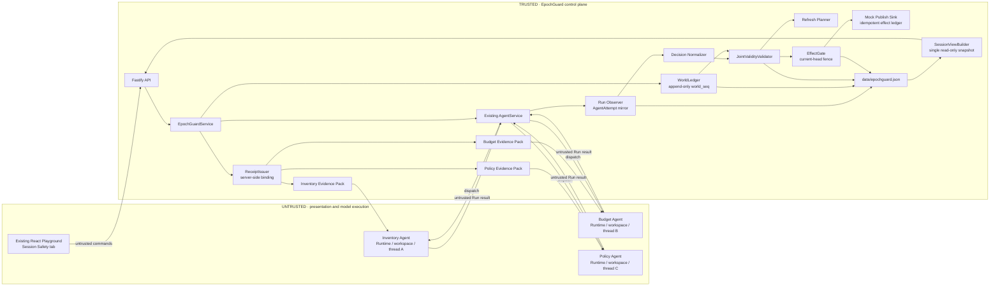
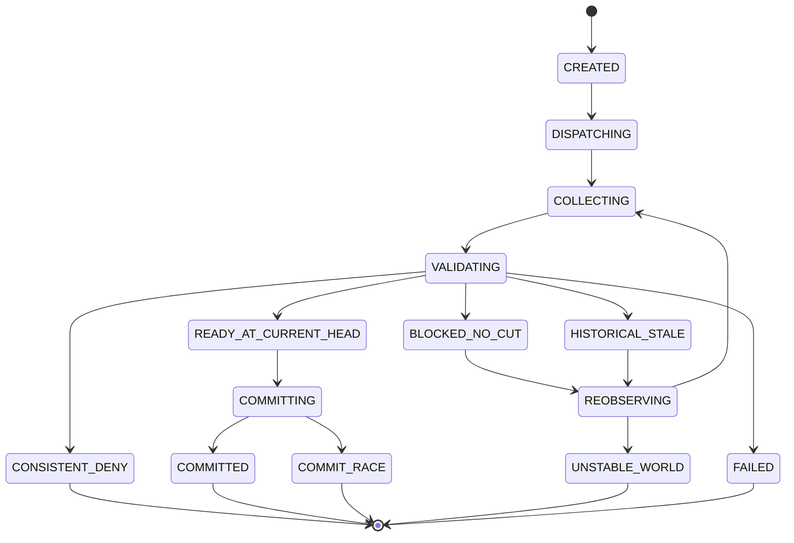

# EpochGuard 最终详细设计方案

> **项目定位：** Joint-Validity Gate for Multi-Agent Decisions  
> **一句话：** Every Agent can be locally right, while the team acts on an observed world that never jointly existed.  
> **中文：** 每个 Agent 都可能局部正确，但团队仍可能依据一个从未共同成立过的“拼接世界”执行动作。

## 0. 最终结论

**条件 GO：EpochGuard 的合同、后端状态机、双场景生产接线、Dashboard、Windows/WSL 自动化门和 controlled-HTTP 浏览器门均已通过；只有最终候选再通过真实 Ark/Codex Run 与完整录屏链路，才升级为正式 Demo GO。任一真实运行硬门失败就立即降级或停止，不能用 FakeRunner 或受控 HTTP 冒充完成。**

它不是聊天机器人、工作流编排器或区块链项目，而是一个执行在后端副作用边界的 Multi-Agent 协调中间件；产品形态是“后端 Effect Gate + 嵌入现有 Playground 的 Session Safety Dashboard”，其中 Dashboard 只展示和操作权威状态，不承担安全判断：

1. 三个隔离 Agent 分别读取库存、预算和政策证据；
2. 每个 Agent 都可以基于当时真实的数据正确返回 `ALLOW`；
3. EpochGuard 验证这些证据是否能在同一个受管理世界版本中共同成立；
4. 若不能，唯一的发布出口拒绝动作并生成机器可检验的冲突证明；
5. 系统只重新观察当前已经失效的证据所有者，而不是重跑全部 Agent；
6. 重新观察后，系统恢复到一个一致、可解释的决定；这个决定可以是安全拒绝，不强求发布成功。

最重要的比赛画面是：

```text
Inventory Agent  ✓ ALLOW
Budget Agent     ✓ ALLOW
Policy Agent     ✓ ALLOW

ALL 3 AGENTS ARE LOCALLY RIGHT
ACTION BLOCKED
NO VALID OBSERVED-WORLD CUT

failure_session.effectsInSession = 0
```

这不是 Baton 的改名：Baton 回答“谁有权执行”，EpochGuard 回答“团队正在依据哪个世界执行”。本故障只有一个 Publisher，没有重试、重复执行、租约或所有权冲突，仍然会发生。

---

## 1. 官方入口核对后的硬约束

本方案以 2026 年 8 月 29 日正式开放后的官方页面为准，而不是此前的五天估算。

### 1.1 时间

- 正式赛段：**2026-08-29 12:00 至 2026-09-01 12:00，SGT / GMT+8**；
- 核对时间：2026-08-29 约 15:09 SGT；
- 当时实际剩余时间：约 **69 小时**；
- 这是 72 小时赛，不再采用“五天实施计划”。

### 1.2 Devpost 当前状态

- 官方入口已经开放；
- 登录后的入口显示 `Start project`，当前尚未创建提交草稿；
- 截止前可以保存和修改草稿，截止后不能再实质修改；
- 建议实现链路跑通后尽早创建草稿，但最终提交操作应由参赛者本人确认。

官方入口：

- [TikTok TechJam 2026 Devpost](https://tiktoktechjam2026.devpost.com/)
- [正式提交入口](https://devpost.com/submit-to/30686-tiktok-techjam-2026/manage/submissions)
- [官方规则](https://tiktoktechjam2026.devpost.com/rules)
- [Track 1 官方信息文档](https://bytedance.larkoffice.com/wiki/GdYFwzWNLiREsSkuIjZcDznInWc)

### 1.3 Track 1 必须交付

1. **不超过三分钟（`≤ 3:00`）的演示视频：** 一个真实 Agent Run，包含正常与失败、拒绝或恢复场景；
2. **一页架构图：** Middleware、数据流、信任边界和执行/恢复点；
3. **公开代码仓库：** 安装说明、问题与动机、设计摘要、自动化测试、演示步骤、限制、无秘密；
4. `npm run check` 必须通过；
5. Middleware 必须执行在后端、Runtime、数据或基础设施路径，不能只做静态 UI；
6. 提交材料使用英文，或同时提供完整英文翻译；
7. 公开 YouTube 演示应展示实际运行，而不是概念动画。

### 1.4 双重评分策略

Track 1 专项评分：

| 类别 | 权重 | EpochGuard 的直接证据 |
| --- | ---: | --- |
| End-to-end middleware behavior | 40% | UI → 3 Agent Runs → Receipts → Validator → Effect Gate → Mock Sink 全链路 |
| Technical design and integration | 25% | 明确信任边界、数据合同、当前 head fence、最小源码改动 |
| Verification and robustness | 20% | 无切面、伪造、缺证据、重放、提交竞态、幂等、选择性恢复测试 |
| Demo and reproducibility | 15% | WSL 一键运行、三分钟单线故事、英文 README、明确限制 |

Devpost 通用评分与 Track 1 专项要求是两层规则，不能混写成同一段官方原文：

- Devpost Stage One 是 pass/fail：项目合理符合主题，并合理应用 TechJam 要求的 API / SDK；
- 采用官方 Starter Kit、真实 Agent Run 和 Track 1 Deliverables，是 Track 1 题目文档的额外硬要求；
- Devpost Stage Two 的 Technical Execution、Innovation & Problem Insight、Feasibility & Practicality、Impact & Relevance **四项等权，各 25%**。

因此优先级必须是：**真实 Ark/Codex Run > 后端完整链路 > 自动化证据 > UI 与叙事 > 扩展功能。**

### 1.5 新旧代码边界

官方规则要求项目在正式赛段内新建，或对已有项目进行显著更新。首次核对源码时，官方 Starter Kit 的实现代码处于干净基线；下列内容保留为赛段开始时的历史证据：

```text
baseline commit: 8d0bd4f14ad1e453d984149aebcdd0bcb4f74178
branch: main
implementation changes: none
design artifact: docs/EPOCHGUARD_FINAL_DESIGN.md
```

当前实现已推进至阶段 8/9 完成：冻结合同 v7、Store、World/Evidence、Decision/JV、Refresh/Effect、Diagnostics/Snapshot/Run Adapter、Coordinator/Routes、双场景 Production Integration 与 Session Safety Dashboard 均已由独立 worktree 实现并合入 `epochguard/staging@f096edd`。精确 SHA 已通过 Windows 聚焦测试、WSL2 干净克隆全 Server 360/360，以及生产无 Mock 的 controlled-HTTP 浏览器门。该状态可用于稳定展示生产外壳和受控生命周期，但仍不等于真实模型端到端比赛演示；真实 Ark 与最终发布门尚未完成。

正式实现应把赛段开始后的新增代码、测试、README 和演示材料保留为清晰的 Git 历史；不要把赛前概念文档冒充实现成果。

当前运行硬阻塞必须显式记录：**`ARK_API_KEY` / `ARK_MODEL` 尚未完成最终候选的真实 Agent Run 验证；若演示选择 container Runtime，Docker daemon 也仍需单独验证。** WSL2 Ubuntu 24.04 与 Node 22 已在干净克隆完成 typecheck、build 和全 Server 360/360，但确定性测试与受控 HTTP 都不能替代真实模型 Runtime；真实运行仍是发布前 Go/No-Go。

### 1.6 资格和提交可用性自检

官方规则还要求参赛者年满 18 岁、当前居住在新加坡、就读于新加坡大学且预计毕业时间不早于 2026 年 12 月；团队最多五名 Eligible Individuals，并由一名代表提交。每位成员应完成官方 Registration Form 和 Devpost 两处注册。本文不替参赛者判断个人资格，提交前必须自行核对。

公开仓库、测试说明和 working project / demo 必须免费、无障碍地供评委测试，至少保持至 **2026-09-07 15:00 SGT** 评审期结束；若入口私有，测试说明必须提供可用凭据。视频、图片、音乐和第三方素材应为自有、开源或已获授权内容。

### 1.7 Dashboard 的官方边界

官方 Starter Kit 扩展说明允许加入所选 Middleware 必需的 UI，并建议 Day 2 完成“minimum UI”；同时明确静态页面不算 Middleware，视觉润色只有在帮助解释所选 Middleware 时才有价值。官方并未把 “Dashboard” 单独列为交付物；本项目把这部分必要 UI 实现为嵌入 Playground 的 Session Safety Dashboard，并遵守四个边界：

1. Dashboard 嵌入现有 Playground，不另做与 Agent 创建、选择和真实 Run 脱节的首页；
2. 每个状态、指标和图形都来自后端 `EpochStore`、真实 `AgentRun` 或确定性验证结果，浏览器不自行推导安全结论；
3. Dashboard 是核心 Middleware 的证据和操作面，不是第四项 Deliverable、第二赛道或独立创新点；
4. 先完成后端阻断、真实 Run 和自动化测试，再投入 Dashboard；若主链未通过 H+24 硬门，立即降级为只读最小状态页。

本项目把它正式命名为 **Session Safety Dashboard**。它只回答四个问题：当前能否发布、为什么、哪条证据冲突、下一步只需重新观察谁。依据见仓库内的 [Hackathon Extension Guide](./HACKATHON_EXTENSION_GUIDE.md)。

---

## 2. 问题定义

普通多 Agent 协调器通常检查：

- 三个 Agent 是否都返回成功；
- 是否收齐所有答案；
- 是否轮到正确 Agent；
- 是否发生超时或重试；
- 是否出现重复执行。

它们通常不会检查一个更隐蔽的问题：

> 三个 Agent 所依据的事实，是否曾在同一个可比较的世界版本中同时成立？

### 2.1 典型失败

一个活动发布动作需要：

- Inventory Agent：至少一个库存名额；
- Budget Agent：至少 5,000 美元预算；
- Policy Agent：活动当前被政策允许。

三个 Agent 分别在不同时间观察：

| Agent | 观察 | 有效区间 | 局部结论 |
| --- | --- | --- | --- |
| Inventory | 1 个名额可用 | `[18, ∞)` | `ALLOW` |
| Budget | 预算 `$8,000` | `[19, 20)` | `ALLOW` |
| Policy | 活动允许 | `[21, ∞)` | `ALLOW` |

在版本 20，预算已经被另一个活动耗尽。Policy 直到版本 21 才允许。因此：

```text
L = max(18, 19, 21) = 21
U = min(∞, 20, ∞) = 20

Valid joint cut exists iff L < U
21 < 20 = false
```

每个 Agent 都可能准确描述了自己观察时的状态，但三个 `ALLOW` 从未共同成立。

### 2.2 为什么不能只加时间戳

观察时间不同，并不必然代表冲突。例如三个值都在 `[10, ∞)` 内持续有效，即使 Agent 在 11、12、13 分别读取，它们仍然共同成立。

EpochGuard 验证的是来源版本的**权威有效区间**，不是简单比较 `observedAt`，也不是要求所有时间戳完全相同。

### 2.3 为什么历史交集仍不够

三个证据在历史上曾共同有效，也不代表现在仍可安全发布：

```text
Inventory [5, 10)
Budget    [5, 10)
Policy    [5, 10)
current head = 20
```

历史切面 5 存在，但现在全部过期。因此 EpochGuard 分两层判断：

1. `JointValidity`：证据是否存在共同受观测世界版本；
2. `ReleaseReadiness`：这些证据是否覆盖发布时的当前 head，并能在 head 不变化的临界区内释放副作用。

### 2.4 为什么常见多 Agent 方案仍会漏掉

| 常见做法 | 能解决什么 | 为什么仍发现不了 Impossible Collage |
| --- | --- | --- |
| Master + Sub-Agent / Plan-and-Execute | 分工、顺序、完成状态 | 通常只检查子任务完成，不证明各自事实曾同时成立 |
| 多数投票或共识 | 处理 Agent 意见不一致 | 本故障里三个 Agent 全部同意，投票仍会错误放行 |
| 共享记忆或共享聊天 | 让 Agent 看见彼此结果 | 看得见不等于这些结果属于同一个有效世界版本 |
| 读取时间戳比较 | 粗略判断新旧 | 异步读取不必然冲突，必须解析来源版本的权威有效区间 |
| 全量重跑所有 Agent | 获得一批更新结果 | 浪费 Token 和等待时间，并引入无关模型漂移 |

如果全部事实本来就在一个数据库事务内，应直接使用数据库快照；EpochGuard 面向的是跨越较长 Agent Run、隔离 workspace / Runtime 和领域判断后，必须在副作用边界再次组合验证的场景。

---

## 3. 产品承诺、精确不变量与边界

### 3.1 对外不变量

> For effects routed exclusively through EpochGuard, no effect is released unless every server-issued, assignment-bound observation receipt is authentic, bound to the same intent and its actual run, valid at one current observed-world head, every domain verdict allows that exact intent, and the protected sink’s freshness and idempotency checks pass.

中文版：

> 对所有只能通过 EpochGuard 释放的动作，只有当服务端签发、绑定一次性 Assignment 的全部观察 Receipt 真实有效，且它们绑定同一意图及各自实际 Run、在同一个当前受观测世界版本中成立、所有领域决定都允许该精确动作，并且 Sink 的新鲜度和幂等检查通过时，副作用才会发生。

### 3.2 这不是区块链

- `epoch` / `world_seq` 只是服务器分配的单调递增整数版本；
- 不使用链、钱包、Token、智能合约或共识；
- Receipt 是服务器签发和存储的观察收据；
- P0 使用高熵 opaque Receipt ID、nonce 和服务端权威 Store；Node.js HMAC 仅是时间允许时的 Stretch，且也不代表公开可验证或不可抵赖。

### 3.3 强保证只覆盖什么

强保证只覆盖：

- 三个注册的 Versioned Source Fixture；
- 由服务端捕获、签发 Receipt 并通过一次性 Assignment 交付给 Agent 的动态证据；
- 通过 EpochGuard 唯一 Effect Gate 执行的本地 Mock Publish Effect；
- 一个单进程、单控制面的逻辑时钟和事件存储。

### 3.4 明确不保证什么

不保证：

- 真实世界绝对正确；
- Agent 的语义推理一定正确；
- Agent 没有使用训练记忆或未声明的隐藏知识；
- 任意第三方 API 能映射到同一时钟；
- 任意远程 API exactly-once；
- serializability、两阶段提交、共识或分布式事务；
- 任意 N-Agent / 任意 DAG 上的全局最优重算；
- 无限状态变化下必然收敛。

无法提供版本、历史、ETag 或重新验证 Token 的来源返回 `UNVERIFIABLE_SOURCE`；不同来源的独立版本号无法比较时返回 `UNCOMPARABLE_CLOCKS`，而不是伪造证明。

---

## 4. 可防守的创新点

算法本身不是创新：半开区间求交、MVCC、OCC、provenance、选择性重算和 consistent snapshot 都有成熟先例。

EpochGuard 的 Hackathon 创新应准确落在以下系统组合上。

### 4.1 Joint-validity 成为不可绕过的 Agent Effect Admission 条件

传统 Agent 输出成功文本后即可由 Coordinator 发布。EpochGuard 把多 Agent 证据的共同有效性提升为后端硬门：没有 `READY_AT_CURRENT_HEAD`，Publisher 根本没有可用调用路径。

### 4.2 三个隔离 Runtime 决定与可信观察进行 Run 级绑定

每个决定不是只携带答案，而是绑定：

```text
session + intent + action + agent + run + source + entity
+ sourceRevision + valueHash + observedAt + receipt
```

Agent 不能自报版本；中间件只认可服务端捕获并保存、与一次性 Assignment 绑定的 Receipt。

### 4.3 无切面时生成机器可检验的反例

EpochGuard 不只显示“数据过期”。它返回：

- `lowerBound`、`upperBound`；
- 最晚开始的证据；
- 最早结束的证据；
- 两条已足够证明无交集的冲突 witness；
- 当前 head 下必须重新观察的证据 owner。

### 4.4 冲突驱动的选择性重新观察

固定三 Agent 合同下：

```text
refreshSet(H) = { owner | H 不在 owner 的证据有效区间内 }
```

失败演示只重跑 Budget：

```text
Inventory runs = 1
Budget runs    = 2
Policy runs    = 1
reruns avoided = 2
```

这减少 Token、等待时间和无关 LLM 漂移。正式表述为 `conflict-directed selective re-observation`，不声称一般图上的全局最优。

### 4.5 Dashboard 是证据面，不是创新替代品

Session Safety Dashboard 把以下后端事实压缩成评委能在数秒内理解的单一运行画面：三个真实 Run、三个权威区间、`L/U`、冲突 witness、当前 head、Effect Gate、Refresh Plan 和最终 effect count。它提高可解释性和演示质量，但不能补偿一个没有真实阻断能力的后端。

因此不能把“做了 Dashboard”列为核心创新；核心创新仍是 Dashboard 背后的 Run-bound evidence、current-head joint-validity、不可绕过的 Effect Gate、机器可检验的反例和定向 re-observation。

### 4.6 不能使用的宣传语

不要说：

- “全球首个 Proof-Carrying Agent 系统”；
- “发明了 Valid World Cut”；
- “新的 MVCC / snapshot isolation”；
- “解决了所有 Agent stale data”；
- “保证真实世界一致”；
- “实现了分布式事务或 exactly-once 外部发布”。

更安全的英文定位：

> EpochGuard is a decision-layer joint-validity gate for asynchronous Agent teams. It binds trusted, versioned observation receipts to isolated Agent decisions, blocks protected effects when those receipts cannot coexist at one admissible observed-world revision, and directs refresh only to invalid evidence owners.

### 4.7 与相邻工作的关系

| 相邻方向 | 已有能力 | EpochGuard 的差异与边界 |
| --- | --- | --- |
| MVCC / Snapshot Isolation | 单数据库事务读取一致快照 | 跨长时 Agent Run 的决定在 Effect Boundary 再验证；单 DB 场景应直接使用数据库事务 |
| MV3C / selective recomputation | 依据冲突和依赖图选择性重算事务 | 选择性重算不是新算法；EpochGuard 只主张把 invalid-owner re-observation 接入 Agent effect-boundary 协议 |
| Chandy–Lamport | 基于 happens-before 捕获进程和信道的全局状态 | 本 MVP 是中央 `world_seq` 上的有效区间求交，不是分布式快照算法 |
| W3C PROV | 描述 Entity、Activity、Agent 的 provenance | EpochGuard 使用更窄的运行绑定，并把结果接入硬性 Effect Gate |
| Proof-Carrying Agent Actions | Action certificate 与 Runtime governance | 不以 proof-carrying 名称本身为创新；重点是多 Agent temporal joint-validity 与选择性重新观察 |
| Multi-Agent concurrency anomaly research | stale-generation、tool-effect ordering 等并发异常 | EpochGuard 做一个比赛尺度、可运行的“局部正确但组合世界不存在”控制面协议 |
| Baton | 执行权、fence、重试和所有权 | EpochGuard 处理证据共同有效性；没有重复执行也会触发 |

---

## 5. 最终系统架构



### 5.1 三个真实 Agent

| Agent | 唯一领域 | 独立状态 | 允许的输入 | 不允许的能力 |
| --- | --- | --- | --- | --- |
| Inventory Agent | 库存 | 独立 Agent ID、workspace、Codex thread、Runtime container | Inventory Evidence Pack | Budget、Policy、Publish |
| Budget Agent | 预算 | 独立 Agent ID、workspace、Codex thread、Runtime container | Budget Evidence Pack | Inventory、Policy、Publish |
| Policy Agent | 政策 | 独立 Agent ID、workspace、Codex thread、Runtime container | Policy Evidence Pack | Inventory、Budget、Publish |

理论上两个 Agent 已足以构造无交集，不能声称数学上必须三个。比赛中使用三个，是为了：

- 证明平台确实协调多个独立 Runtime；
- 建立三个独立知识和权限 owner；
- 现场展示 `1/3 refresh`；
- 满足官方 Multi-Agent Coordination 方向的真实多 Agent 证据。

Coordinator 是确定性服务，不算第四个 Agent。

P0 不允许把任意现有聊天 Agent 临时指派给安全角色。首次设置时创建或注册三个专用 Role Agent，并保存 `roleProfileVersion + AGENTS.md digest`；Session 创建时要求三个 Agent ID 不同、状态可运行且 digest 与注册值一致。UI 在 Session active 时禁用这些 Agent 的编辑/Chat 入口，但这只是防误操作，不是安全边界；服务端必须在每次初始/refresh dispatch 前以及接受输出前重新读取实际 `AGENTS.md` 并核 digest，任何中途修改都使 Attempt 失败且 effect=0。

```ts
interface RoleAgentRegistration {
  role: "inventory" | "budget" | "policy";
  agentId: string;
  agentNameAtRegistration: string;
  roleProfileVersion: string;
  agentsMdDigest: string;
  registeredAt: string;
}
```

`EpochGuardService.initialize()` 通过现有 `AgentService.createAgent()` 幂等创建缺失的三个 Demo Role Agent，并把 Registration 保存到 EpochStore；它不接管或改写用户已有 Chat Agent。已注册 Agent 被删除、编辑或 digest 不匹配时，Session 创建 fail closed，Dashboard 显示明确 setup 错误，由操作者重新初始化专用 Agent，不能静默覆盖用户内容。可恢复的旧 Codex thread 仍可能包含历史指令，因此模型输出始终不可信；Profile/digest、当前 Receipt/nonce 和后端 Gate 只保证历史内容不能冒充权威证据或直接发布，并不保证模型没有受到旧上下文影响。

### 5.2 信任边界

可信：

- World Ledger / logical sequencer；
- Receipt Issuer / Observation Capture Service；
- Run Observer / AgentAttempt mirror；
- Decision Normalizer；
- JointValidity Validator；
- Refresh Planner 的确定性规则；
- Effect Gate；
- 本地 Mock Sink 和 EpochStore；
- SessionViewBuilder 的只读投影逻辑。

不可信：

- 三个 LLM Runtime；
- Agent 输出中自报的 epoch、区间和值；
- 浏览器和 UI；
- Prompt 中声称的事实；
- Agent workspace 内被修改后的 Evidence Pack 副本。

核心原则：**服务端存储的是权威 Receipt；Agent 只携带 Receipt ID。验证器永远不把 Agent 回传的区间当事实。**

防止模型“瞎编工具参数”的核心也不在 Prompt 劝告，而在权限和绑定：P0 不给 Agent 任意生产工具或 Publish capability；模型只能回传结构化 Verdict 及高熵引用，真实 Run、版本、区间和动作参数全部由服务端查回。任何 Marker、Schema、Session、Action、Agent、Role、Assignment、Run、Receipt 或 nonce 不匹配都 fail closed，`effect=0`。

### 5.3 为什么使用文件 Evidence Pack

官方 Container Runner 使用 bridge 网络；WSL、Docker Desktop、Podman 对访问宿主 API 的方式不同。69 小时内做通用 HTTP Tool Gateway 风险过高。

主线设计：

1. 后端根据 World Ledger 生成服务器 Receipt；
2. 将 Evidence Pack 原子写入各自 workspace 的 `.epochguard/`；
3. 真实 Codex Runtime 读取该文件并完成领域判断；
4. Agent 必须回传不可猜测的 Receipt ID；
5. Validator 只信服务器保存的 Receipt 和绑定关系。

这应准确表述为真实 `model + file/data action`，不夸称三个 Agent 调用了生产 API。

### 5.4 Agent 框架与编排选型

必须区分 `React` 与 `ReAct`：React 只是现有 Playground 的前端框架；本项目没有采用 LangGraph，也没有自行实现显式 ReAct 或 Plan-and-Execute 图。底层沿用官方 `AgentService + Codex CLI + Ark` Runtime，EpochGuard 在外部增加 TypeScript 确定性中间件。

整体是固定状态机驱动的 fan-out / join Workflow，不是 LLM Master 带 Sub-Agent：

```text
Inventory ─┐
Budget    ─┼→ deterministic join → validator → Effect Gate
Policy    ─┘
```

三个 Agent 平级，Coordinator 不是第四个 Agent。选择这种架构是因为角色和依赖固定，安全边界必须可复现、可审计、可自动测试；不能让另一个可能幻觉的 Master Agent 决定证据是否可信。它也比引入动态图框架更符合 72 小时范围。

### 5.5 上下文、记忆与 Skills 边界

| 层次 | P0 使用什么 | 能否作为当前事实 |
| --- | --- | --- |
| 单 Run 上下文 | 极薄 Prompt、ActionIntent、Evidence Pack | 只有服务器 Receipt 可证明其中动态事实 |
| Agent 短期连续性 | Starter Kit 持久化的 workspace 与 `codexThreadId` | 不能；历史对话和旧指令均视为不可信输入 |
| 系统持久状态 | EpochStore 中的 Session、Assignment、Receipt、active Decision、Validation、Effect、Event | 可作为审计和验证输入 |
| 长期语义记忆 | 不做向量库、embedding、自动摘要或用户画像 | 不适用 |

库存、预算或政策即使曾出现在历史对话中，也必须由当前 Assignment 的服务端 Receipt、nonce 和可确定性重建的 Evidence Pack 重新证明。P0 不修改官方 Runner 来强制 fresh thread，因此不能宣称上下文完全隔离；它使用三个专用、版本锁定的 Role Agent，并把旧线程当作可能污染模型输出的不可信输入。旧 Receipt/nonce/Role/Profile 引用会在 Normalizer fail closed；但如果旧指令诱导模型在正确回传当前绑定字段的同时给出错误 Verdict，协议会把它视为合法但语义错误的候选决定。该风险属于第 3.4 节明确排除的 Agent 推理正确性，由 Role oracle 评测暴露，不能伪称 Receipt 绑定已经解决。

P0 也不实现通用 Skills Registry。Starter Kit 通过各 workspace 的 `AGENTS.md` 提供身份和静态指令，EpochGuard 再用固定 Role Profile 版本与 digest、独立 workspace / Runtime、领域 Evidence Pack、严格输出 Schema 和无 Publish 权限形成最小 capability boundary。真正的 `skill id/version + input/output schema + allowed tools + permission scope + timeout + audit policy` 只能列入后续工作，不能冒充当前能力。

---

## 6. 权威世界模型

### 6.1 World Commit

一次 World Commit 可同时改变一个或多个资源，并获得一个全局递增序号：

```ts
interface WorldCommit {
  seq: number;
  changes: Array<{
    resourceId: string;
    previousVersionId: string | null;
    nextVersionId: string;
  }>;
  reason: string;
  createdAt: string;
}
```

### 6.2 Resource Version

```ts
interface ResourceVersion {
  id: string;
  resourceId: string;
  sourceRevision: number;
  value: JsonValue;
  valueHash: string;
  validFromSeq: number;
  validUntilSeq: number | null;
}
```

有效区间采用半开区间：

```text
[validFromSeq, validUntilSeq)
```

若预算在 20 被修改：

```text
Budget $8,000  [19, 20)
Budget $0      [20, ∞)
```

在 seq 20，旧值已经无效，新值已经生效。`[19,20)` 与 `[20,∞)` 的交集为空。

同一个值消失后又恢复，必须生成新版本，不能合并不连续区间。

---

## 7. 核心数据合同

### 7.1 Action Intent

```ts
interface ActionIntent {
  schemaVersion: 1;
  actionId: string;
  sessionId: string;
  type: "PUBLISH_CAMPAIGN";
  campaignId: string;
  requestedUnits: number;
  estimatedCostCents: number;
  market: "SG";
  actionHash: string;
  idempotencyKey: string;
}
```

P0 的浏览器不编辑动作字段，只提交注册的 `scenarioId` 和三个 Agent assignment；服务端从只读 fixture 加载完整动作字段，不接受浏览器提交 Hash、幂等键或任意 World history。服务端先用 Zod 验证 fixture，再使用唯一的 canonical 规则派生：

```text
canonicalAction = canonicalJSON({
  schemaVersion,
  type,
  campaignId,
  requestedUnits,
  estimatedCostCents,
  market
})

actionHash    = "sha256:" + sha256(canonicalAction)
idempotencyKey = sessionId + ":" + actionHash
```

`canonicalJSON` 使用固定字段集合、固定键顺序和标准 JSON 标量编码；明确排除 `actionId`、`sessionId`、`actionHash` 与 `idempotencyKey` 本身，避免循环定义。数量、金额、目标或市场变化后，Hash 必变，旧 Receipt、证书和 Permit 均不能复用。

P0 不做自然语言入口、LLM 查询改写或多轮补充。注册 fixture 通过验证后，由固定 Role 合同确定性拆成 inventory / budget / policy 三个查询，并分别计算绑定 `actionHash + source + entityKey + query parameters` 的 `queryHash`。若 fixture 缺少数量、费用、市场或活动标识，API 明确拒绝创建 Session，且不 dispatch 任何 Agent；模型无权猜值。

若赛后扩展为自由动作，补充信息也必须通过 typed form 完成，不能让模型静默改写。任一核心字段或 fixture 版本改变后，服务端重新 canonicalize 并产生新 `actionHash`，之前的 Assignment、Receipt、Decision、Validation 和 Permit 全部不能复用；该扩展不进入 69 小时 P0。

查询不是只保存一个不可解释的 Hash。服务端从 canonical ActionIntent 生成、持久化并可重建版本化的规范：

```ts
type RoleQuerySpec =
  | {
      schemaVersion: 1;
      actionHash: string;
      role: "inventory";
      source: "inventory";
      entityKey: string;
      actionProjection: { campaignId: string; requestedUnits: number };
      queryHash: string;
    }
  | {
      schemaVersion: 1;
      actionHash: string;
      role: "budget";
      source: "budget";
      entityKey: string;
      actionProjection: { campaignId: string; estimatedCostCents: number };
      queryHash: string;
    }
  | {
      schemaVersion: 1;
      actionHash: string;
      role: "policy";
      source: "policy";
      entityKey: string;
      actionProjection: { campaignId: string; market: "SG" };
      queryHash: string;
    };
```

`entityKey` 也不能自由填写：`epoch-query-key-v1` 固定派生为 `inventory → campaignId`、`budget → campaignId`、`policy → market`。`queryHash = sha256(canonicalJSON({ schemaVersion, actionHash, role, source, entityKey, actionProjection }))`；`canonicalJSON` 采用各判别分支的固定字段/键顺序，并明确排除 `queryHash` 本身。Validator 用同一版本映射重新构造整个 Spec 并核对 Hash，不相信 Receipt 中孤立的字符串。Session 创建后 ActionIntent 不可变，改变动作只能新建 Session 并保留旧审计。Spec 不匹配返回 `QUERY_HASH_MISMATCH`，缺字段返回 `422 MISSING_ACTION_FIELDS`，两者都不签发 Receipt。

### 7.2 One-Time Run Assignment

```ts
interface RunAssignment {
  assignmentId: string;
  sessionId: string;
  actionHash: string;
  agentId: string;
  agentNameAtAssignment: string;
  role: "inventory" | "budget" | "policy";
  receiptId: string;
  queryHash: string;
  roleProfileVersion: string;
  promptTemplateVersion: string;
  agentsMdDigest: string;
  runtimeLabelAtDispatch: string;
  evidencePackRelativePath: string;
  evidencePackHash: string;
  boundRunId: string | null;
  status: "CREATED" | "BOUND" | "CONSUMED" | "REJECTED";
  consumedByDecisionCertificateId: string | null;
  createdAt: string;
  boundAt: string | null;
  consumedAt: string | null;
}

interface AgentAttempt {
  attemptId: string;
  sessionId: string;
  actionHash: string;
  role: "inventory" | "budget" | "policy";
  agentId: string;
  assignmentId: string;
  runId: string | null;
  status:
    | "ASSIGNMENT_CREATED"
    | "DISPATCHING"
    | "QUEUED"
    | "RUNNING"
    | "COMPLETED"
    | "FAILED"
    | "INTERRUPTED"
    | "OUTPUT_REJECTED"
    | "ACCEPTED";
  runStartedAt: string | null;
  runCompletedAt: string | null;
  threadId: string | null;
  usage: RunUsage | null;
  outputDigest: string | null;
}
```

`RunUsage` 直接复用 Starter Kit 的 `inputTokens / cachedInputTokens / outputTokens` 类型，不另造计费模型。

`agentNameAtAssignment` 与 `runtimeLabelAtDispatch` 在 Assignment 创建时分别从当时的 Agent 记录和 `AgentService.systemInfo()` 冻结进 EpochStore；ViewBuilder 不再去 AgentService Store 读取当前名称或 Runtime，因此后续改名、切换配置也不会重写历史证明。

绑定协议必须是一次性的：

1. 服务端先创建 Assignment，再签发绑定该 Assignment 的 Receipt / Evidence Pack；
2. `sendMessage()` 返回真实 queued `runId` 后，在一次 `EpochStore.mutate()` 中要求 `boundRunId == null && status == CREATED`，随后写入 `boundRunId` 和 `BOUND`；
3. Normalizer 从服务端真实 Run 记录获得 `runId`，要求它等于 `assignment.boundRunId`，并同时校验 Agent、Role、Session、Action、Receipt；
4. 接受决定时在一次 mutation 中把 Assignment 标为 `CONSUMED` 并绑定唯一 Decision Certificate；
5. Assignment 不能绑定第二个 Run、不能消费两次，后续 Run 引用旧 Receipt 一律拒绝；
6. Coordinator 观察 `AgentService.getRun()` 的每次状态变化时，先把脱敏状态镜像到 EpochStore 的 `AgentAttempt` 并递增 revision；Run 完成后固化时间、usage、output digest 和可用 thread evidence，再在同一次 mutation 中接受或拒绝 Decision。

Dashboard、Validator 与 Effect Gate 不在读取时临时 join `launchpad.json` 和 `epochguard.json`。`AgentService` Store 是外部 Runner 状态源；一旦状态被观察并镜像，EpochGuard 的 View/安全决策只读取单次 `EpochStore.snapshot()` 中的 Run Evidence，避免所谓“单快照”跨两个独立 JSON Store 撕裂。

### 7.3 Observation Receipt

```ts
interface ObservationReceipt {
  schemaVersion: 1;
  receiptId: string;

  sessionId: string;
  actionHash: string;
  agentId: string;
  runAssignmentId: string;
  role: "inventory" | "budget" | "policy";

  source: "inventory" | "budget" | "policy";
  entityKey: string;
  queryHash: string;
  sourceRevision: number;
  valueHash: string;

  observedAtSeq: number;
  nonce: string;
  issuer: "epochguard";
  issuedAt: string;
  integrityTag?: string;
}
```

`validFromSeq` / `validUntilSeq` 都不由 Agent 或 Receipt 冗余声明。Validator 在验证时使用 `(source, entityKey, sourceRevision)` 从权威历史解析完整区间，找不到或历史已裁剪就返回 `HISTORY_UNVERIFIABLE` 并 fail closed。

`observedAtSeq` 是服务端捕获该 Evidence Pack 时的 world head，不是 Agent 稍后打开文件的时刻。Receipt 绑定不可复用的 `runAssignmentId`；实际 Run ID 由权威 Assignment 映射绑定，不信任 Agent 自报。P0 以高熵 Receipt ID、nonce 和服务端权威存储完成绑定；HMAC `integrityTag` 仅作为 Stretch 的本地静态防篡改增强，不是公开可验证签名。

### 7.4 Evidence Pack

写入：

```text
<agent-workspace>/.epochguard/
  sessions/<sessionId>/<role>/<assignmentId>.json
```

每个 Assignment 一个独立路径，EpochGuard 自身永不覆盖旧 Pack；workspace 文件仍属于不可信 Runtime，不能把文件权限称为不可变。下面是 Budget 示例；`evidencePackHash` 保存在服务端 Assignment 中：

```json
{
  "assignment": {
    "runAssignmentId": "assignment_...",
    "sessionId": "session_...",
    "role": "budget",
    "actionHash": "sha256:...",
    "queryHash": "sha256:...",
    "roleProfileVersion": "budget-v1",
    "promptTemplateVersion": "epoch-prompt-v1"
  },
  "action": {
    "campaignId": "campaign_42",
    "estimatedCostCents": 500000
  },
  "observation": {
    "receiptId": "receipt_...",
    "nonce": "unguessable_...",
    "remainingBudgetCents": 800000,
    "observedAtSeq": 19
  },
  "decisionRule": "ALLOW iff remainingBudgetCents >= estimatedCostCents.",
  "responseMarker": "EPOCH_DECISION"
}
```

三个最小 Role 投影固定为：

| Role | Action projection | Observation | 唯一规则 |
| --- | --- | --- | --- |
| Inventory | `campaignId, requestedUnits` | `availableUnits` | `availableUnits >= requestedUnits` |
| Budget | `campaignId, estimatedCostCents` | `remainingBudgetCents` | `remainingBudgetCents >= estimatedCostCents` |
| Policy | `campaignId, market` | `permitted` | `permitted === true` |

`EvidencePackWriter.buildCanonicalPack()` 是纯函数：只从 EpochStore 中的 frozen ActionIntent、RoleQuerySpec、Assignment、Receipt 和对应 ResourceVersion 重建固定字段顺序的 canonical bytes，再计算 hash 并写 workspace。EpochStore 保存全部重建原料与 expected `evidencePackHash`，因此“服务器副本”指可确定性重建的权威内容，不是假设 workspace 里另有一份可信文件；Normalizer 可重建并核 hash，Dashboard 也只显示 expected hash。

动态观察值只存在 Pack，不复制进 Prompt。给 Agent 的 Prompt 只提供 Assignment-scoped 相对文件路径、Assignment ID 和输出格式，也不复制 `receiptId` 或 nonce；返回当前高熵 nonce 能证明模型接触过该 Pack 的内容，但不能证明具体文件读取路径、没有使用旧记忆或语义推理一定正确。Agent 修改 workspace 副本不会改变服务器 Receipt、ResourceVersion 或 expected Pack hash；这类修改最多影响未可信候选 Verdict，不能直接改变 Gate 输入或发布参数。

静态角色边界写在 workspace 的 `AGENTS.md`；每次 Run 的动态 Prompt 保持极薄：

```text
You are the Budget Agent for assignment assignment_....
Read .epochguard/sessions/<sessionId>/budget/<assignmentId>.json.
Use only the immutable action and evidence in that file.
Do not infer missing facts or claim a publish action.
Return exactly one <EPOCH_DECISION>{...}</EPOCH_DECISION> envelope.
```

Prompt 不复述业务值、Receipt ID 或 nonce，也不要求模型创建 Todo List。单 Agent 只有“读证据 → 领域判断 → 严格输出”一个收敛任务；可靠的 Todo 已外置为服务端状态机。这样减少 Token、跑题和格式漂移，并提供可复现的 `model + file/data action` 证据，但不夸称能够证明模型内部推理过程。

### 7.5 Agent Decision Envelope

Agent 最后必须输出：

```text
<EPOCH_DECISION>
{
  "schemaVersion": 1,
  "sessionId": "session_...",
  "actionHash": "sha256:...",
  "runAssignmentId": "assignment_...",
  "role": "budget",
  "receiptId": "receipt_...",
  "nonce": "unguessable_...",
  "verdict": "ALLOW",
  "reason": "Remaining budget covers the requested spend."
}
</EPOCH_DECISION>
```

Parser 要求恰好一个 Marker envelope、无尾随自由文本，并使用 Zod `.strict()` 拒绝额外动作或工具参数。Envelope 不接受自报 `runId`；Normalizer 从完成该消息的权威 Run Evidence 注入它。重复/缺失 Marker、JSON 非法、额外字段、错误 nonce、Receipt/Assignment 不存在、跨 Role/Action 重放、Assignment 未绑定该 Run、已消费，或任一绑定错误时，状态为 `DECISION_INVALID`，且副作用为零。生产 Sink 参数永远由服务器 canonical ActionIntent 构造，不从模型 reason 或任意工具参数提取。

### 7.6 Dependency Certificate

它由中间件根据合法 Envelope 和服务器 Receipt 构造，不由 LLM 自己签发：

```ts
interface DependencyCertificate {
  certificateId: string;
  sessionId: string;
  actionHash: string;
  agentId: string;
  runAssignmentId: string;
  runId: string;
  role: "inventory" | "budget" | "policy";
  verdict: "ALLOW" | "DENY";
  receiptIds: [string];
  decisionDigest: string;
  status: "ACTIVE" | "SUPERSEDED";
  supersededByCertificateId: string | null;
  constructedBy: "epochguard";
  createdAt: string;
}
```

MVP 强制每个 Agent 恰好一条动态 Receipt，且决定只能依赖本领域 Pack 与不可变 `ActionIntent`，不允许引用其他 Agent 输出作为动态前提。Validator 要求 `certificate.runId === assignment.boundRunId` 且 `assignment.consumedByDecisionCertificateId === certificate.certificateId`。

每个 Session 还维护唯一 active pointer：

```ts
type ActiveDecisionCertificateIds = {
  inventory: string | null;
  budget: string | null;
  policy: string | null;
};

// EpochSession.activeDecisionCertificateIds: ActiveDecisionCertificateIds
```

首次接受决定时写入对应 Role 的 active ID。Budget refresh 成功后，在同一次 mutation 中创建新 Budget Certificate、把旧 Certificate 标为 `SUPERSEDED` 并指向新 ID、再原子替换 active Budget pointer；旧决定只留作审计。Composer 与 Validator 只能读取三个 active ID，Permit 和 `dependencySetHash` 也只能由这三个 active 决定对应的 Receipt 构成，绝不能从 `decisions[]` 自行“挑一个”。

Session 与每次验证也必须冻结，而不是靠扫描数组猜“最新”：

```ts
interface EpochSession {
  sessionId: string;
  scenarioId: "normal-world-v1" | "impossible-collage-v1";
  action: ActionIntent;
  actionHash: string;
  state:
    | "CREATED" | "DISPATCHING" | "COLLECTING" | "VALIDATING"
    | "BLOCKED_NO_CUT" | "HISTORICAL_STALE" | "REOBSERVING"
    | "UNSTABLE_WORLD" | "CONSISTENT_DENY" | "READY_AT_CURRENT_HEAD"
    | "COMMITTING" | "COMMITTED" | "COMMIT_RACE" | "FAILED" | "INTERRUPTED";
  sessionRevision: number;
  coordinationMode: "PENDING" | "CONCURRENT" | "SEQUENTIAL_FALLBACK";
  frozenAssignments: {
    inventoryAgentId: string;
    budgetAgentId: string;
    policyAgentId: string;
  };
  activeDecisionCertificateIds: ActiveDecisionCertificateIds;
  activeAttemptIds: {
    inventory: string | null;
    budget: string | null;
    policy: string | null;
  };
  activeValidationId: string | null;
  activeRefreshPlanId: string | null;
  activePermitId: string | null;
  stateUpdatedAt: string;
  createdAt: string;
}

interface ValidationRecord {
  validationId: string;
  sessionId: string;
  actionHash: string;
  baseSessionRevision: number;
  decisionCertificateIds: [string, string, string];
  dependencySetHash: string;
  validatedHead: number;
  outcome:
    | "VALID_CURRENT_ALLOW"
    | "CONSISTENT_DENY"
    | "NO_VALID_OBSERVED_WORLD_CUT"
    | "HISTORICAL_BUT_STALE_NOW"
    | "FAILED";
  lowerBound: number | null;
  upperBound: number | null;
  jointValidityCertificateId: string | null;
  noCutProofId: string | null;
  refreshPlanId: string | null;
  verificationLatencyMs: number;
  createdAt: string;
}
```

active pointer 的替换、ValidationRecord、JVC/No-Cut Proof、RefreshPlan/Permit 引用与 `sessionRevision++` 位于同一个 mutation；后续 refresh 不会改变旧 ValidationRecord 的决定集合。
所有三元素 `decisionCertificateIds` tuple 固定按 `[inventory, budget, policy]` 排序。

### 7.7 Joint Validity Certificate

```ts
interface JointValidityCertificate {
  certificateId: string;
  validationId: string;
  sessionId: string;
  actionHash: string;
  dependencySetHash: string;
  validatedAtHead: number;
  selectedCutSeq: number;
  currentHeadCovered: boolean;
  decisionCertificateIds: [string, string, string];
  intervals: Array<{
    receiptId: string;
    source: string;
    sourceRevision: number;
    from: number;
    until: number | null;
  }>;
  validatorVersion: "epochguard-jv-v1";
  createdAt: string;
}
```

### 7.8 Effect Permit

```ts
interface EffectPermit {
  permitId: string;
  sessionId: string;
  actionHash: string;
  dependencySetHash: string;
  jointValidityCertificateId: string;
  validatedHead: number;
  idempotencyKey: string;
  status: "ISSUED" | "CONSUMED" | "REVOKED";
  issuedAt: string;
  consumedAt: string | null;
}
```

Permit 由服务端签发，只能消费一次；任何 Action、Dependency Set、Joint Validity Certificate、head 或幂等键不匹配都拒绝。

### 7.9 No-Cut Proof

```ts
interface NoCutProof {
  proofId: string;
  validationId: string;
  reason: "NO_VALID_OBSERVED_WORLD_CUT";
  sessionId: string;
  actionHash: string;
  dependencySetHash: string;
  decisionCertificateIds: [string, string, string];
  validatedAtHead: number;
  lowerBound: number;
  upperBound: number;
  latestStartingReceiptId: string;
  earliestEndingReceiptId: string;
  conflictWitnessReceiptIds: [string, string];
  refreshAgentIds: string[];
  createdAt: string;
}
```

### 7.10 Effect Record

```ts
interface EffectRecord {
  effectId: string;
  type: "PUBLISH_CAMPAIGN";
  idempotencyKey: string;
  permitId: string;
  sessionId: string;
  actionHash: string;
  dependencySetHash: string;
  jointValidityCertificateId: string;
  createdAt: string;
}
```

这形成 `Effect → Permit → Joint Validity Certificate → active Decisions → Receipts → Source Versions` 的可追溯链。`effectsInSession` 不是额外可写计数器，而是 `EffectRecord.sessionId` 的服务端派生计数，避免展示值与真实 Effect Ledger 分叉。

### 7.11 Session Dashboard Snapshot

Dashboard 不分别读取六个接口，也不在 GET 时临时 join AgentService Store；否则展示层自己也可能组合出一个“不同时刻的世界”。Coordinator 先把观察到的真实 Run 状态镜像为 EpochStore `AgentAttempt`，ViewBuilder 再只从传入的一次 `EpochStore.snapshot()` 构造只读投影。

```ts
interface RefreshPlan {
  refreshPlanId: string;
  sessionId: string;
  baseSessionRevision: number;
  validatedHead: number;
  dependencySetHash: string;
  activeDecisionCertificateIds: string[];
  agentIds: string[];
  status: "AVAILABLE" | "CLAIMED" | "COMPLETED" | "INVALIDATED";
  claimedAttemptId: string | null;
}

type FailureCode =
  | "ROLE_PROFILE_MISMATCH"
  | "RUN_FAILED"
  | "RUN_TIMEOUT"
  | "OUTPUT_MALFORMED"
  | "BINDING_MISMATCH"
  | "DECISION_INVALID"
  | "ACTION_HASH_MISMATCH"
  | "QUERY_HASH_MISMATCH"
  | "HISTORY_UNVERIFIABLE"
  | "UNVERIFIABLE_SOURCE"
  | "UNCOMPARABLE_CLOCKS"
  | "NO_VALID_OBSERVED_WORLD_CUT"
  | "HISTORICAL_BUT_STALE_NOW"
  | "CONSISTENT_DENY"
  | "UNSTABLE_WORLD"
  | "COMMIT_RACE"
  | "ALREADY_REOBSERVING"
  | "STALE_VIEW"
  | "UNSUPPORTED_SCHEMA"
  | "PROJECTION_MISMATCH";

interface RejectedOutputArtifact {
  artifactId: string;
  sessionId: string;
  attemptId: string;
  reason: "PARSE_REJECTED" | "OUTPUT_TOO_LARGE";
  originalDigest: string;
  originalByteLength: number;
  sanitizedContent: string | null;
  sanitizedContentDigest: string | null;
  truncated: boolean;
  redactionVersion: "epoch-redact-v1";
  createdAt: string;
}

interface ArtifactRef {
  kind:
    | "ATTEMPT" | "ASSIGNMENT" | "RUN" | "ENVELOPE_DIGEST" | "REJECTED_OUTPUT"
    | "RECEIPT" | "SOURCE_VERSION" | "VALIDATION" | "PROOF"
    | "REFRESH_PLAN" | "PERMIT" | "EFFECT";
  id: string;
}

interface SafetyDiagnostic {
  diagnosticId: string;
  sessionId: string;
  actionHash: string;
  sessionRevision: number;
  fixtureRef: string | null;
  kind: "EXPECTED_BLOCK" | "SYSTEM_FAILURE" | "TRANSIENT_RACE";
  stage:
    | "DISPATCH"
    | "RUN"
    | "PARSE"
    | "NORMALIZE"
    | "COMPOSE"
    | "VALIDATE"
    | "PLAN_REFRESH"
    | "ISSUE_PERMIT"
    | "COMMIT"
    | "EFFECT"
    | "PROJECTION";
  reasonCode: FailureCode;
  role: "inventory" | "budget" | "policy" | null;
  attemptId: string | null;
  assignmentId: string | null;
  runId: string | null;
  artifactRefs: ArtifactRef[];
  causedByDiagnosticIds: string[];
  expected: JsonValue | null;
  actual: JsonValue | null;
  rejectedOutputArtifactId: string | null;
  auditSeq: number;
  recommendedAction: "NONE" | "NEW_SESSION" | "REOBSERVE_INVALID";
}

interface SafetyDiagnosticView {
  diagnosticId: string;
  kind: SafetyDiagnostic["kind"];
  stage: SafetyDiagnostic["stage"];
  reasonCode: FailureCode;
  role: "inventory" | "budget" | "policy" | null;
  relevantIds: ArtifactRef[];
  auditSeq: number;
  recommendedAction: SafetyDiagnostic["recommendedAction"];
}

interface AuditEvent {
  eventId: string;
  sessionId: string;
  actionHash: string;
  sessionRevision: number;
  auditSeq: number;
  type: string;
  status: string;
  role: "inventory" | "budget" | "policy" | null;
  artifactRefs: ArtifactRef[];
  createdAt: string;
}

interface RedactedDashboardEvent {
  eventId: string;
  sequence: number;
  type: string;
  status: string;
  role: "inventory" | "budget" | "policy" | null;
  summary: string;
  createdAt: string;
}

interface SessionDashboardSnapshot {
  schemaVersion: 1;
  snapshotRevision: number; // global Store response ordering
  sessionRevision: number;  // CAS for this Session's commands
  stateUpdatedAt: string;
  generatedAt: string;

  sessionId: string;
  scenarioId: "normal-world-v1" | "impossible-collage-v1";
  coordinationMode: "PENDING" | "CONCURRENT" | "SEQUENTIAL_FALLBACK";
  sessionState:
    | "CREATED"
    | "DISPATCHING"
    | "COLLECTING"
    | "VALIDATING"
    | "BLOCKED_NO_CUT"
    | "HISTORICAL_STALE"
    | "REOBSERVING"
    | "UNSTABLE_WORLD"
    | "CONSISTENT_DENY"
    | "READY_AT_CURRENT_HEAD"
    | "COMMITTING"
    | "COMMITTED"
    | "COMMIT_RACE"
    | "FAILED"
    | "INTERRUPTED";
  action: {
    type: "PUBLISH_CAMPAIGN";
    campaignId: string;
    requestedUnits: number;
    estimatedCostCents: number;
    market: "SG";
  };
  actionHash: string;
  worldHead: number;

  gate: {
    state:
      | "WAITING"
      | "CHECKING"
      | "LOCKED"
      | "READY"
      | "RELEASED"
      | "FAILED";
    reasonCode: string | null;
    effectsInSession: number;
    permitId: string | null;
    effectId: string | null;
  };

  metrics: {
    activeDecisions: number;
    requiredDecisions: 3;
    allowDecisions: number;
    denyDecisions: number;
    reobservedAgents: number;
    totalAgents: 3;
    rerunsAvoided: number;
    verificationLatencyMs: number | null;
  };

  agents: Array<{
    role: "inventory" | "budget" | "policy";
    agentId: string;
    agentNameAtAssignment: string;
    runCount: number;
    activeDecision: {
      certificateId: string;
      runId: string;
      verdict: "ALLOW" | "DENY";
      factSummary: string;
      evidenceState: "CURRENT" | "RETAINED" | "INVALID_AT_HEAD";
      receipt: {
        receiptId: string;
        sourceRevision: number;
        observedAtSeq: number;
        validFromSeq: number;
        validUntilSeq: number | null;
      };
      runtimeProof: {
        assignmentId: string;
        threadId: string | null;
        runtimeLabel: string;
        roleProfileVersion: string;
        promptTemplateVersion: string;
        agentsMdDigest: string;
        evidencePackRelativePath: string;
        evidencePackHash: string;
        runStartedAt: string | null;
        runCompletedAt: string | null;
        outputDigest: string | null;
        usage: {
          inputTokens?: number;
          cachedInputTokens?: number;
          outputTokens?: number;
        } | null;
      };
    } | null;
    inFlightAttempt: {
      attemptId: string;
      assignmentId: string;
      runId: string | null;
      status:
        | "ASSIGNMENT_CREATED"
        | "DISPATCHING"
        | "QUEUED"
        | "RUNNING"
        | "COMPLETED"
        | "FAILED"
        | "INTERRUPTED"
        | "OUTPUT_REJECTED";
      runStartedAt: string | null;
      runCompletedAt: string | null;
    } | null;
  }>;

  jointValidity: {
    state: "PENDING" | "VALID_CURRENT" | "NO_CUT" | "HISTORICAL_STALE";
    lowerBound: number | null;
    upperBound: number | null;
    currentHeadCovered: boolean | null;
    noCutProof: {
      proofId: string;
      dependencySetHash: string;
      lowerBound: number;
      upperBound: number;
      witness: Array<{
        role: "inventory" | "budget" | "policy";
        receiptId: string;
        from: number;
        until: number | null;
      }>;
    } | null;
  };

  refreshPlan: {
    refreshPlanId: string;
    status: "AVAILABLE" | "CLAIMED" | "COMPLETED";
    agentIds: string[];
    reasonCode: string;
  } | null;
  availableActions: Array<"REOBSERVE_INVALID" | "COMMIT">;
  latestDiagnostics: SafetyDiagnosticView[]; // current Session, max 3
  events: RedactedDashboardEvent[];
}
```

刷新期间同一 Role 可以同时存在“仍是 active 的旧 Decision”和“正在运行的新 Attempt”，所以两者必须分字段展示；不得把新 Run status 与旧 Verdict 拼成一张假卡。新 Budget Decision 被接受时，在一个 mutation 中执行 `old Decision → SUPERSEDED`、替换 active pointer、`Attempt → ACCEPTED`、清空 in-flight；失败则保留旧证据供诊断，但 Gate 继续锁定。

`snapshotRevision` 随任意 EpochStore mutation 单调增加，用于响应排序；每个 `EpochSession.sessionRevision` 只在该 Session 变化时递增，用作 refresh / commit CAS，避免其他 Session 的事件造成误 409。`generatedAt` 是本次成功 HTTP 投影时间，即使 revision 没增长也表示连接新鲜；`stateUpdatedAt` 才表示业务状态最近变化时间。

`sessionState` 表示协议进度，`gate.state` 只表示副作用出口：例如 `CONSISTENT_DENY` 映射为 `gate=LOCKED`、`reasonCode=CONSISTENT_DENY`，UI 显示 `RESOLVED SAFELY / NOT RELEASED`。`availableActions` 只是 UI 提示，后端在真正 refresh / commit 时仍完整重验。Snapshot 不包含 API Key、环境变量、完整 Prompt、绝对 workspace 路径或未脱敏模型输出，也不新增 Dashboard 数据库。未知 enum / Schema 必须显示 `UNSUPPORTED STATE — ACTIONS DISABLED`，不能静默映射为 `WAITING`。

Parser 对模型输出设置 16 KiB 上限。上限内的拒绝输出经过固定 secret redactor 后完整保存为 `RejectedOutputArtifact.sanitizedContent`，供同版本 Parser 离线重放；超限只保存 byte length、digest 和 `OUTPUT_TOO_LARGE`，不伪称可完整重放。Dashboard 只收到 DiagnosticView 和 Artifact ID，从不收到 rejected content。

---

## 8. 完整协议

```text
World Observation
→ Server Receipt
→ Evidence Pack
→ Real Agent Run
→ Decision Envelope
→ Dependency Certificate
→ Decision Composition
→ Joint-Validity Validation
→ Current-Head Validation
→ One-Time Effect Permit
→ Atomic Validate-and-Release
```

三个 Agent 不通过自然语言互相说服，也没有一个 LLM Master 决定谁可信。它们通过同一个不可变 ActionIntent、各自最小 Evidence Pack、结构化 Decision 和服务端 Certificate 协作；确定性 Coordinator 负责 fan-out / join，Validator 负责组合事实，Effect Gate 负责唯一副作用。

详细步骤：

1. 用户在 Playground 选择场景和三个注册、Profile digest 匹配的专用 Role Agent；
2. Coordinator 固定 `ActionIntent`，计算 `actionHash`；
3. World Simulator 按确定性脚本**交错执行 World Commit 与 Observation Capture**，不是先推进到终点再一次性读取；
4. 每次捕获时，服务端原子创建一次性 Assignment、记录当时 head、签发权威 Receipt，并生成对应 Evidence Pack；
5. 后端把 Evidence Pack 写入独立 workspace，Prompt 只告知路径和 Assignment ID；
6. `AgentService.sendMessage()` 启动真实 Run，返回 `runId` 后立刻用一次 Store mutation 单次绑定 Assignment；Coordinator 随后把每次观察到的 Run 状态镜像进 AgentAttempt；
7. Agent 读取文件、作领域判断、回传 Assignment ID、Receipt ID、nonce 和结构化 Envelope；
8. Normalizer 从 EpochStore 中已镜像的权威 Run Evidence 取得真实 `runId`，验证 Envelope、Assignment、Run、Agent、Role/Profile、Action/query、Pack hash、Receipt 全绑定，并单次消费 Assignment；
9. Composer 要求 Inventory、Budget、Policy 恰好各一个决定，每个决定恰好一条本领域动态 Receipt；
10. Validator 从 Ledger 解析三个 Receipt 的权威区间和 exact dependency-set hash；
11. 无交集时返回绑定该依赖集合的 No-Cut Proof，Effect Gate 保持关闭；
12. 有历史交集但未覆盖当前 head 时返回 `HISTORICAL_BUT_STALE_NOW`；
13. 当前 head 被全部覆盖但任一 Agent 为 `DENY` 时返回 `CONSISTENT_DENY`；
14. 当前 head 被全部覆盖且三者都 `ALLOW` 时签发一次性 Permit；
15. Effect Gate 在同一个 `EpochStore.mutate()` 中重验完整 Assignment / Run / Action / Receipt / 区间 / head / 幂等绑定，再原子写入 Mock Effect 并消费 Permit；
16. 无切面时，Refresh Planner 只启动当前 head 下证据无效的 owner；
17. 新 Agent 决定返回后，全部 Receipt 重新组合、重新验证，旧 Permit 不能复用；
18. `SessionViewBuilder` 只从单次 EpochStore snapshot 构造同 revision 的 Dashboard Snapshot，不在 GET 时跨 Store 查询；前端只负责展示和发命令。

首轮路由固定 fan-out 到三个 Role；补充轮不是继续整段对话，也不是全队重跑，而是按 `refreshSet(H)` 只创建失效 owner 的新 Assignment / Receipt / Run。新决定原子替换该 Role 的 active pointer，其他 Role 的有效决定继续保留。

Impossible 场景的捕获顺序固定为：

```text
commit 18 Inventory=1   → capture Inventory Receipt at 18
commit 19 Budget=$8000  → capture Budget Receipt at 19
commit 20 Budget=$0
commit 21 Policy=permit → capture Policy Receipt at 21
then write the three Packs and dispatch the three Runs
```

因此旧 Budget Receipt 是在版本仍有效时由服务端真实捕获的；Agent 后续读取文件的 wall-clock 时刻不改变 `observedAtSeq=19`。

---

## 9. 形式化验证算法

验证时捕获当前 head `H`。`world_seq` 是离散整数，因此对于仍开放的区间，在本次计算中保守使用 `H + 1` 作为有效上界；这只表示它覆盖当前整数 head，不表示未来永远有效。

对所有必需证据 (i\)：

```text
Ii = [from_i, until_i)
```

计算：

```text
L = max(from_i)
U = min(until_i)
```

历史共同有效性：

```text
L < U
```

当前释放必要条件：

```text
for every i: from_i <= H < until_i
```

伪代码：

```text
validate(sessionId, actionHash, decisionCertificates):
    H = worldLedger.head
    require exactly one Inventory, Budget, Policy decision
    require serverCanonicalHash(currentAction) == actionHash

    intervals = []
    receiptIds = []

    for decision in decisionCertificates:
        require decision.sessionId == sessionId
        require decision.actionHash == actionHash
        require decision.receiptIds.length == 1

        assignment = assignmentStore.require(decision.runAssignmentId)
        require assignment.status == CONSUMED
        require assignment.boundRunId == decision.runId
        require assignment.consumedByDecisionCertificateId == decision.certificateId
        require decision.run / agent / role / session / action binding is valid

        receiptId = decision.receiptIds[0]
        receipt = serverReceiptStore.require(receiptId)
        require receipt.runAssignmentId == assignment.assignmentId
        require receipt.receiptId == assignment.receiptId
        verify session / action / agent / role / source binding

        version = worldLedger.requireVersionOrFailClosed(
            receipt.source,
            receipt.entityKey,
            receipt.sourceRevision,
            HISTORY_UNVERIFIABLE
        )

        require version.valueHash == receipt.valueHash
        effectiveUntil = version.validUntilSeq ?? (H + 1)
        require version.validFromSeq <= receipt.observedAtSeq
        require receipt.observedAtSeq < effectiveUntil
        require receipt.observedAtSeq <= H

        intervals.push({
            receiptId,
            owner: decision.agentId,
            from: version.validFromSeq,
            until: effectiveUntil
        })
        receiptIds.push(receiptId)

    dependencySetHash = sha256(canonicalJSON(sort(receiptIds)))

    L = max(interval.from)
    U = min(interval.until)

    if L >= U:
        return NO_VALID_OBSERVED_WORLD_CUT(
            conflictWitness(intervals, L, U, H, dependencySetHash)
        )

    currentInvalidOwners = unique owner of each interval not containing H

    if currentInvalidOwners is not empty:
        return HISTORICAL_BUT_STALE_NOW(currentInvalidOwners)

    if any decision.verdict == DENY:
        return CONSISTENT_DENY

    jointCertificate = jointValidityCertificate(
        sessionId, actionHash, intervals, dependencySetHash,
        selectedCutSeq = H
    )
    permit = oneTimePermit({
        sessionId,
        actionHash,
        dependencySetHash,
        jointValidityCertificateId: jointCertificate.certificateId,
        validatedHead: H,
        idempotencyKey: sessionId + ":" + actionHash
    })
    return READY_AT_CURRENT_HEAD(jointCertificate, permit)
```

时间复杂度固定为三条依赖，实际是常数；一般表示为 `O(m)`。

### 9.1 冲突证明

当 `L >= U`：

- 选择 exact dependency set 中 `from = L` 的最晚开始 Receipt；
- 选择 exact dependency set 中 `until = U` 的最早结束 Receipt；
- 因为 `U <= L`，这两条区间已互不相交，足以证明全集没有共同交集。

`NoCutProof.dependencySetHash` 是稳定排序后的完整 Receipt ID 集合的 Hash，witness 两项必须属于该集合。并列时按 Receipt ID 排序，保证输出确定性。

`proofId` 在创建对应 ValidationRecord 的同一 mutation 中只生成一次并持久化；Dashboard 只投影该 ID，不能在每次 GET 时随机生成。

### 9.2 当前 head 下的选择性刷新

```text
R_H = { agent owner | owner 的证据不覆盖 H }
```

仅在 MVP 的固定合同下——每个 Agent 恰好一条本领域 Receipt，决定只依赖该 Pack 和不可变 Action，不依赖其他 Agent 输出——它才是当前 head 的必要最小 owner 集，因为：

- `R_H` 中每个 Agent 的唯一动态证据在 H 无效，其决定必须替换；
- `R_H` 外的 Agent 唯一动态证据仍覆盖 H，且不存在跨 Agent 动态依赖，决定可以保留；
- 刷新过程中若 head 变成 `H'`，必须重新计算，不能沿用旧计划。

Planner 把结果持久化为绑定 `baseSessionRevision + validatedHead + dependencySetHash + activeDecisionCertificateIds` 的一次性 RefreshPlan。head、active pointer 或 Session revision 变化会原子标记旧 Plan `INVALIDATED`；同一 Plan 只能从 `AVAILABLE` 领取一次，重复请求返回 `ALREADY_REOBSERVING + attemptId`，不能重复 dispatch。

P0 只实现演示所需的一轮显式 Budget refresh；刷新期间若 head 再变化就返回 `UNSTABLE_WORLD` 并拒绝副作用。自动重规划和最多两轮刷新属于 Stretch，不影响核心演示。

### 9.3 原子 Effect Gate

仅预先验证仍有 TOCTOU：

```text
head 20: validate passes
head 21: budget changes
then publish
```

因此 Permit 绑定：

```text
validatedHead + actionHash + dependencySetHash + idempotencyKey
```

所有 World 更新也必须通过同一个 `EpochStore` 串行 mutation 队列，并且每个 World Commit 都递增 head；否则 `head unchanged` 不能成为 fence。Mock MVP 的 Commit 在一个 `EpochStore.mutate()` 中：

```text
capture head
→ derive canonical actionHash and idempotencyKey again
→ if an Effect with matching sessionId + actionHash + idempotencyKey exists, return that same Effect
→ require Permit status ISSUED and every Permit field matches
→ load Permit.jointValidityCertificateId and require its session / action / dependency set / validated head match
→ load exactly the Session's three active Decision IDs; reject superseded Decisions
→ revalidate every Assignment / Run / Decision / Receipt / dependency hash / interval
→ require current head == permit.validatedHead
→ lookup idempotencyKey again inside this critical section
→ if absent, append exactly one Effect and mark Permit CONSUMED
→ atomically replace the JSON store
```

JSON Store 没有数据库 `UNIQUE` 约束；exactly-one 的本地机制是串行 mutation 中“先按 key 查找，存在则返回同一 Effect，否则 append”，并让 append 与 Permit consume 处于同一次原子 replace。生产外部 API 只有支持 ETag / If-Match、CAS 或条件幂等写时才能提供同等级保证。

Agent、浏览器和 Coordinator 没有 Publisher capability；唯一可 append `EffectRecord` 的模块是 Effect Gate。

---

## 10. 状态机



P0 将 `COMMIT_RACE` 视为当前业务 Session 的终态：服务端持久化 `TRANSIENT_RACE / COMMIT` Diagnostic，保持 effect=0，不在原 Session 内自动回到 `VALIDATING`。恢复方式是 reset 后新建 Session；前端只能 GET 权威 Snapshot，不得自动重放 Commit。

单 Agent Attempt：

```text
ASSIGNED → RUNNING → SUBMITTED → ACCEPTED
                    ↘ INVALID
                    ↘ FAILED

ACCEPTED → RETAINED
ACCEPTED → STALE → REOBSERVED
```

服务器重启时，进行中的 `COLLECTING / VALIDATING / REOBSERVING / COMMITTING` Session 标记 `INTERRUPTED`，未消费 Permit 作废，不自动恢复副作用。

---

## 11. 两个确定性演示场景

### 11.1 Normal World：正常发布一次

世界：

```text
seq 10: Inventory = 1, Budget = $8,000, Policy = permitted
head 10: three Agents observe asynchronously at different wall-clock times
         while all three source versions remain [10,∞)
```

结果：

```text
Inventory ALLOW [10,∞)
Budget    ALLOW [10,∞)
Policy    ALLOW [10,∞)

VALID AT CURRENT HEAD 10
EffectPermit issued
normal_session.effectsInSession = 1
```

重复点击 Commit，计数仍为 1。

### 11.2 Impossible Collage：三者都 ALLOW，但动作被拒绝

世界：

```text
seq 18: Inventory = 1 available                  → server captures Inventory Receipt
seq 19: Budget = $8,000                          → server captures Budget Receipt
seq 20: Budget = $0 after a competing campaign spends it
seq 21: Policy = permitted                       → server captures Policy Receipt
```

三个 Pack 在各自版本生效时被服务端交错捕获，随后才分发给三个 Runtime；所以 Budget 的 `$8,000` 不是在 head 21 伪造出来的历史值。

三个原始决定：

```text
Inventory ALLOW  [18,∞)
Budget    ALLOW  [19,20)
Policy    ALLOW  [21,∞)
```

验证：

```text
lowerBound = 21
upperBound = 20
21 >= 20

NO_VALID_OBSERVED_WORLD_CUT
conflict witness = Budget old version × Policy permitted version
failure_session.effectsInSession = 0
```

当前 head 21：

```text
Inventory receipt covers 21 → retain
Budget receipt excludes 21  → refresh
Policy receipt covers 21    → retain
```

只重跑 Budget Agent：

```text
Budget observes $0 [20,∞)
Budget verdict = DENY
```

刷新后：

```text
joint current world = valid at 21
team result = CONSISTENT_DENY
failure_session.effectsInSession = 0

Inventory run count = 1
Budget run count    = 2
Policy run count    = 1
```

“恢复”的目标是回到可信、完整、可解释的团队决定，不是强迫动作成功。

---

## 12. 与官方 Starter Kit 的最小接入

### 12.1 当前可复用能力

现有源码已经具备：

- React Agent CRUD 和 Playground；
- Fastify API；
- `AgentService.sendMessage()`；
- 每个 Agent 独立 workspace 和 Codex thread；
- 不同 Agent 可并行，各 Agent 自身仅允许一个 active Run；
- 本地 Disposable Runtime Container；
- JSON 原子替换 Store；
- Run 轮询 UI 和现有测试框架。

### 12.2 新增服务端文件

```text
apps/server/src/epochguard/
  types.ts
  epoch-store.ts
  role-profiles.ts
  world-ledger.ts
  receipt-issuer.ts
  evidence-pack-writer.ts
  run-observer.ts
  decision-parser.ts
  joint-validity-validator.ts
  refresh-planner.ts
  effect-gate.ts
  safety-diagnostics.ts
  session-view-builder.ts
  epochguard-service.ts
  routes.ts
  fixtures.ts
```

### 12.3 最小前后端改动

```text
apps/server/src/workspace.ts
  增加 canonical Evidence Pack 原子写与实际 AGENTS.md digest 读取方法

apps/server/src/index.ts
  实例化 EpochStore 和 EpochGuardService

apps/server/src/app.ts
  注册 /api/epochguard/* 路由

apps/server/src/types.ts
apps/server/src/agent-service.ts
  仅给 AgentRun 增加 nullable threadId，并在 Runner 完成时与 usage/时间一同保存；旧记录默认 null

apps/web/src/api.ts
apps/web/src/types.ts
apps/web/src/App.tsx
apps/web/src/styles.css
  增加 Chat / EpochGuard 模式切换、Snapshot DTO、命令调用和响应式网格

apps/web/src/epochguard/useEpochGuardSession.ts
  管理 Session 创建、约 900ms 轮询、revision 去重、AbortController、陈旧计时和命令 pending

apps/web/src/epochguard/EpochGuardDashboard.tsx
  只负责场景控制与证据面板渲染，不在组件内重新推导 Gate、L/U 或 refresh owner
```

`App.tsx` 保留现有 Agent 侧栏、创建/生命周期和 Playground 外壳，只挂载 Session Safety；它持有 `workspaceMode + activeEpochSessionId + draftRoleAssignments`，所以切回 Chat 再返回不会丢 Session。Session 开始后标题和卡片只使用冻结 assignment，不再用侧栏当前选中 Agent 解释正在运行的 Session。

`useEpochGuardSession` 复用现有 fetch 认证和轮询风格；每次创建/切换/卸载递增 `requestGeneration` 并取消旧请求，写 React state 前同时要求 `response.sessionId === currentSessionId` 且 generation 未变化，防止旧 Session 的晚响应串入新页面。command pending 时禁用全部 mutation 按钮，但 GET 轮询继续。不引入新 Router、Redux、D3、状态管理框架或独立前端工程。P0 的 Timeline 使用 CSS grid / absolute bars，Agent 卡、Gate、Refresh Planner 和 Event Ledger 可先作为 `EpochGuardDashboard.tsx` 内部小组件，主链稳定后再拆文件。

不修改：

- `AgentRunner` 接口；
- `CodexRunner`；
- `ContainerCodexRunner`；
- ECS / Terraform。

`AgentRun.threadId` 是唯一对 Starter 运行记录的加法字段，不改变 Runner 接口或 Chat 行为；其目的只是让每条真实 Run 的证明可冻结，而不是读取 Agent 当前 thread 猜历史归属。

### 12.4 独立数据存储

新增：

```text
data/epochguard.json
```

```ts
interface EpochDatabase {
  schemaVersion: 1;
  snapshotRevision: number;
  headSeq: number;
  roleAgentRegistrations: RoleAgentRegistration[];
  worldCommits: WorldCommit[];
  resourceVersions: ResourceVersion[];
  roleQuerySpecs: RoleQuerySpec[];
  runAssignments: RunAssignment[];
  receipts: ObservationReceipt[];
  sessions: EpochSession[];
  attempts: AgentAttempt[];
  decisions: DependencyCertificate[];
  validations: ValidationRecord[];
  jointValidityCertificates: JointValidityCertificate[];
  noCutProofs: NoCutProof[];
  refreshPlans: RefreshPlan[];
  permits: EffectPermit[];
  effects: EffectRecord[];
  diagnostics: SafetyDiagnostic[];
  rejectedOutputArtifacts: RejectedOutputArtifact[];
  auditEvents: AuditEvent[];
}
```

复制现有 `JsonStore` 的串行队列、临时文件和 rename 模式，避免迁移 `launchpad.json`。P0 只支持**单 Node 进程、单 EpochStore writer**；Promise queue + rename 不是跨进程锁，禁止多个服务副本共享同一个 JSON 文件。Dashboard 所需 Run 状态先镜像进 `AgentAttempt`，ViewBuilder 不跨 Store 读实时值。

### 12.5 Agent Run 协调

`EpochGuardService`：

1. 先按 fixture 的 18→19→20→21 顺序完成 World Commit、Observation Capture、Assignment 与三个 Assignment-scoped Evidence Pack；每次 dispatch 前从磁盘重算 Role Profile digest；
2. 使用 `roles.map(async role => dispatchBindPoll(role))` 立即创建三条完整 Promise，再统一 `Promise.allSettled()`，而不是在循环中逐个 await 后假称并发；
3. 每次 `sendMessage()` 返回 queued Run 后，立即用短 mutation 把 Assignment 单次绑定到真实 Run ID；
4. 使用 200–500ms 有界轮询 `getRun()`；每次状态变化先镜像进 EpochStore `AgentAttempt`，terminal 时固化 threadId、时间、usage 与 output digest；
5. Normalizer 接受输出前再次读取 Role Profile digest，并只使用镜像的权威 Run Evidence、可重建 Pack hash和一次性 Assignment，不使用 LLM 自报 Run ID；
6. 任一 Run 超时、失败或输出非法时，join fail closed，未消费/孤立 Assignment 标为 `REJECTED`，不得用两个局部结果签发 Permit；
7. 用三条真实 `startedAt/completedAt` 是否重叠决定 `coordinationMode=CONCURRENT`；不稳定时可顺序启动，但必须显示 `SEQUENTIAL_FALLBACK`；
8. 不使用 FakeRunner 作为最终演示。

这里没有通用的“并行意图识别”。固定 RoleQuerySpec 已声明 Inventory、Budget、Policy 模型任务互不依赖，所以三个**模型 Run**可以并发收集；Impossible fixture 的 World Commit / Observation Capture 必须串行构造，最终 Validation / Effect Commit 也必须串行。自动化测试分别证明“并发运行区间确实重叠”“单 Run 失败 effect=0”“并发不改变证据捕获顺序”；若改为顺序 fallback，文案和 Dashboard 同步如实标注。

---

## 13. API 设计

```text
POST /api/epochguard/sessions
GET  /api/epochguard/sessions/:id
POST /api/epochguard/sessions/:id/refresh
POST /api/epochguard/sessions/:id/commit
```

Validation 不是公开按钮：三个 active Decision 收齐或 refresh 完成后，由服务端状态机自动执行同一套确定性转换，Dashboard 不能手工要求“再算一次”或选择某组历史 Decision。

开发与自动化测试专用，不进入正式 Dashboard 主路径：

```text
POST /api/epochguard/demo/reset
GET  /api/epochguard/world
GET  /api/epochguard/effects/:campaignId
```

创建 Session：

```json
{
  "scenarioId": "impossible-collage-v1",
  "assignments": {
    "inventory": "agent-uuid-a",
    "budget": "agent-uuid-b",
    "policy": "agent-uuid-c"
  }
}
```

只接受服务器注册的 `scenarioId`；不允许浏览器提交任意 World history 或任意 JavaScript Policy。

`GET /api/epochguard/sessions/:id` 是 Dashboard 唯一的读取入口，返回第 7.11 节定义的同 revision `SessionDashboardSnapshot`。它不是把内部 Store 原样暴露，而是一个脱敏、只读、服务端已计算的 Projection，包括：

- 受保护动作摘要、Agent / Runtime / Run / Thread 标识；
- 每个领域的 Fact、Receipt、区间和 Verdict；
- `L`、`U`、当前 head；
- conflict witness；
- refresh owner；
- Effect Gate 状态和 `effectsInSession`；
- 实际测量的验证延迟；
- 结构化 Safety Diagnostics 与 Event Ledger。

六个面板不能各自请求 world、runs、validations、effects 后在浏览器拼装；一个 Snapshot 驱动整张 Dashboard，避免显示层自己产生版本撕裂。`GET /world` 和 `GET /effects/:campaignId` 仅供测试/调试，不参与 UI 安全推导。

命令接口同样不接受可信字段：

- `POST /refresh` 的 body 只有 `{ expectedSessionRevision, refreshPlanId }`，不接受任意 `agentId`；
- `POST /commit` 的 body 只有 `{ expectedSessionRevision }`，不接受浏览器提交的 head、Permit、区间、Gate 状态或 effect count；若 Effect 已存在则在 revision 检查前幂等返回原 Effect，否则核对 Session revision 后，从 Store 完整重验、append Effect 并 consume Permit，全部位于一个短串行 mutation；
- `POST /demo/reset` 只在开发/测试模式重置注册 fixture，不执行广泛删除，也不作为 UI 的“新建 Session”按钮；
- 所有命令在 Store mutation 中重新验证，不信任 Snapshot 中曾经显示的 `availableActions`。

Refresh 不能在持有 Store mutation 时等待模型。事务分三段：

1. 短 mutation 通过 CAS 领取 `AVAILABLE` Plan，核对 `baseSessionRevision + validatedHead + dependencySetHash + activeDecisionCertificateIds`，创建唯一 Assignment/Attempt，写 `Plan=CLAIMED`、`Session=REOBSERVING` 后释放锁；
2. 锁外原子写 Assignment-scoped canonical Evidence Pack，并调用真实 `AgentService.sendMessage()`；
3. 新的短 mutation 把 queued Run ID 单次绑定到刚才的 Assignment。发送失败则记录 Diagnostic、标记 `FAILED/INTERRUPTED` 并保持 Gate 锁定，不自动重复 dispatch。

两个并发 refresh 若携带同一 `refreshPlanId`，只有一个能把 Plan 从 `AVAILABLE` 改为 `CLAIMED`；其余返回 `409 ALREADY_REOBSERVING` 和当前 `attemptId`，不创建第二个 Budget Run。响应丢失时前端通过下一次 GET 看到 in-flight Attempt，不自动重放命令；“重放同一 HTTP 请求并返回相同命令结果”留作 Stretch。其他 Session 变化只增加全局 `snapshotRevision`，不影响本 Session CAS；只有 `sessionRevision` 或 Plan 绑定已经过期才返回 `409 STALE_VIEW` 和最新 Session revision。

Dashboard 打开期间沿用现有约 900ms 固定轮询，不在 69 小时内增加 SSE 或 WebSocket。收到较旧的同 Session `snapshotRevision` 时丢弃；连续三次请求失败或超过 3 秒没有成功 Snapshot 就显示 `VIEW STALE — ACTIONS DISABLED`，暂停 UI 操作，但后端仍保持最终安全边界。`/demo/reset` 只在 development/test 配置注册，正式运行不存在该路由。

---

## 14. 嵌入 Playground 的 Session Safety Dashboard

Session Safety Dashboard 不是额外装饰或独立 BI 页面，而是同一 Session 状态机的操作与证据投影：它展示真实 Run 和后端 Gate 的结果，但不参与真实性判断、不计算安全结论，也不拥有发布权限。

默认受众是评委、技术审查者和演示操作者。首屏必须在五秒内回答：保护什么动作、三个 Agent 是否真的运行、团队结论是什么、证据是否共同有效、为什么阻断、副作用是否发生、下一步只需重新观察谁。

### 14.1 入口和操作边界

保留现有 Agent 侧栏、Create Agent、生命周期与 Chat。在 Playground 主区顶栏增加：

```text
[ Agent Chat ] [ Session Safety ]
```

`Session Safety` 只替换现有消息区和 Composer，不创建新首页。用户流程：

1. 从已有 Agent 侧栏选择三个已经注册为 Inventory / Budget / Policy 的专用 Role Agent；未注册或 Profile digest 不匹配的普通 Chat Agent 不可选；
2. 后端验证三个 ID 不同、状态可运行、Role/Profile 版本匹配且当前没有编辑或 active Run；
3. 选择 `Normal World` 或 `Impossible World`；
4. 点击 `Run Scenario`，Session 随即冻结 Role assignments，之后切换侧栏不改变正在运行的 Session；
5. `BLOCKED_NO_CUT` 时只显示服务端授权的 `Re-observe Budget only`；
6. `READY_AT_CURRENT_HEAD` 时可以显示 `Commit protected effect`，点击后后端仍完整重验；
7. `New Demo Session` 再次调用 `POST /sessions`，创建新的注册 fixture Session，不修改旧审计记录；开发用 `/demo/reset` 不出现在正式 UI。

绝不提供 `Force release`、`Ignore proof`、手工编辑 interval/head/effect count 或任意选择 refresh Agent 的能力。

### 14.2 首屏信息架构

```text
┌──────────────────────────────────────────────────────────────────┐
│ Playground [Agent Chat | Session Safety]  Publish campaign_42  │
│ [Normal | Impossible] I:Inv B:Bud P:Pol  CONCURRENT [Run]      │
├──────────────┬──────────────┬──────────────┬────────────────────┤
│ TEAM         │ WORLD CUT    │ EFFECT       │ RE-OBSERVATION     │
│ 3/3 ALLOW    │ NONE L21≥U20 │ BLOCKED · 0  │ Recommended 1/3    │
├──────────────────┬──────────────────┬───────────────────────────┤
│ Inventory Agent  │ Budget Agent     │ Policy Agent              │
│ Run/Fact/Verdict │ Run/Fact/Verdict │ Run/Fact/Verdict         │
│ Receipt [18,∞)   │ Receipt [19,20)  │ Receipt [21,∞)           │
├───────────────────────────────────────────┬──────────────────────┤
│ OBSERVED-WORLD INSPECTOR                  │ EFFECT GATE          │
│ v18 ─ v19 ─ v20 ─ v21│HEAD               │ ⛔ LOCKED · count 0  │
│ Inventory ●━━━━━━━━━━━━━━━━━━             ├──────────────────────┤
│ Budget       ●━━━━○                       │ REFRESH PLANNER      │
│ Policy                  ●━━━━             │ Budget only [Run]    │
│ ∅ · Budget B19 × Policy P21               │ avoids 2 reruns      │
├───────────────────────────────────────────┴──────────────────────┤
│ EVENT LEDGER · same snapshot/session revision · Evidence <details>│
└──────────────────────────────────────────────────────────────────┘
```

四个 Summary 是同一条紧凑 Session 状态带的四格，不做四套分析卡或趋势图。1080p 无滚动必须看到三张真实 Run 卡、World Inspector，以及合并展示的 Effect Gate / Refresh；状态带可以并入标题。Event Ledger 与 Evidence 折叠，不强迫全部信息同时塞进首屏。完整技术标识和 Raw Proof 使用原生 `<details>`，不挤占主画面。

P0 只实现“状态带 + 三卡 + Inspector/等价区间表 + Gate + 一个服务端授权 Refresh + 最近事件”。卡片联动、转场动画、复杂筛选和通用日志浏览都不是 P0；若布局拥挤，先把 Inspector 降级为等价区间表，不能删掉 Gate 或真实 Run 证据。

### 14.3 Hero summaries 的定义与来源

| Summary | 精确定义 | 唯一权威来源 |
| --- | --- | --- |
| `Team Decisions` | 三个 active Decision Certificate 的完成数与 Verdict | `activeDecisionCertificateIds` |
| `Observed-World Cut` | `VALID @ vH`、`NONE · L≥U` 或 `STALE` | 最新 Validation Record |
| `Protected Effect` | `WAITING/BLOCKED/RELEASED` 与本 Session Effect 数 | Permit + Effect Records |
| `Re-observation` | 推荐/完成 owner 数和避免的重跑数 | Refresh Plan + Agent Attempts |

`worldHead`、Snapshot freshness 和实际 `verificationLatencyMs` 是小型上下文指标，不与 Hero 混成独立结论。三个关键画面应分别为：

```text
Normal:      3/3 ALLOW       | VALID @ v10       | RELEASED · 1     | 0/3
Impossible:  3/3 ALLOW       | NONE · L21≥U20    | BLOCKED · 0      | Recommended 1/3
Recovered:   2 ALLOW·1 DENY  | VALID @ v21       | NOT RELEASED · 0 | Completed 1/3
```

`invalid effects released = 0` 是测试套件指标，不作为单个 Session 的实时 Hero；Dashboard 不能用一次演示自证长期安全性。

### 14.4 World Inspector、Gate 与交互

World Inspector 使用 CSS Grid / absolute bars，不引入 D3。必须显示离散版本刻度、当前 head、半开区间闭起点 `●` / 开终点 `○`、`L/U`、`∅`、两条 conflict witness 和自然语言解释：

```text
No shared revision.
Budget evidence ended at v20.
Policy permission began at v21.
```

失败时直接依据 Snapshot 突出 Budget 与 Policy witness，Inventory 降低视觉权重但不隐藏；点击 Agent 卡联动高亮属于 Stretch，不改变后端状态。`Raw proof` 只用原生 `<details>` 展示后端 No-Cut Proof JSON，不实现复杂 Proof Explorer。

Gate 状态必须同时使用文字、图标和颜色：`WAITING`、`CHECKING`、`LOCKED`、`READY`、`RELEASED`、`FAILED`。恢复为安全 `DENY` 时显示中性 `RESOLVED SAFELY / NOT RELEASED`，不能用绿色暗示动作已发布。按钮是否可见来自 Snapshot `availableActions`，但后端不信任按钮状态。

### 14.5 Run-bound Evidence Details 与 Badcase 定位

三张卡默认显示冻结的 Agent 名称/Role、active Decision 的短 Run ID、Fact、Verdict、Receipt 区间、证据状态和 run count；若 refresh 正在进行，在同一卡片独立显示 `inFlightAttempt`，绝不把新 Run 与旧 Verdict 混成一个状态。P0 的 Run-bound Evidence `<details>` 只需当前 Session 的 Agent/Run/Assignment/Receipt/Validation ID；Runtime、Thread、Pack 相对路径与 hash、source revision、起止时间和 usage 是数据合同已支持但有余时才展示的扩展。任何层级都不显示本机绝对用户名路径、API Key、完整环境变量或未脱敏 Prompt，也不扩展成通用 Agent observability / token 成本产品。

Dashboard 的诊断链直接复用权威工件：

```text
Session / Action → Safety Diagnostic / Validation → Attempts
                 → Assignment / Real Run → Envelope / Receipt → Source Version
                 → (成功路径才有) Permit → Effect
```

P0 界面只显示当前 Session 最新的 `stage + reasonCode + relevant IDs`、No-Cut witness 和上面的绑定链，不做通用故障浏览器。开发者按 `sessionId + actionHash + sessionRevision` 在 Store / 测试日志中查找第一个异常边界：Run/输出错误看 Runtime 与 Parser，绑定错误看 Assignment 与 Normalizer，`L/U` 或 witness 错误看 Ledger 与 Validator，refresh owner 错误看 Planner，Permit/Effect 错误看 Gate 与 Store。`NO_CUT`、`HISTORICAL_STALE` 和一致 `DENY` 记为 `EXPECTED_BLOCK`，不是系统崩溃；多根因分析和跨 Session 诊断产品化属于 Stretch。Conflict witness 直接指向冲突 Receipt 及需要重新观察的 Agent。

### 14.6 空态、错误态、新鲜度与可访问性

| 状态 | Dashboard 表现 | 允许操作 |
| --- | --- | --- |
| Demo Role Agent 未初始化、缺失或 digest 变化 | 指出具体 Role/Profile 问题，指标为 `—` | 初始化/重新注册专用 Agent |
| Dispatch / Collect / Validate | 卡片显示 queued/running，Gate `WAITING/CHECKING` | 禁止重复 Run |
| No Cut / Historical Stale | 预期安全阻断，显示 proof，不渲染成系统崩溃 | 仅服务端授权 refresh |
| Consistent Deny | `RESOLVED SAFELY`，effect 仍为 0 | 新建 Session |
| Committed | Effect ID，count=1 | 新建 Session |
| Run failed / Interrupted / Unstable | 指明 Role / Run，Gate 锁定，Permit 作废 | P0 新建 Session |
| API 断开或 Snapshot 超时 | 保留最后确认值并显示 `VIEW STALE` | 禁止 refresh / commit |
| `409 STALE_VIEW` | 保留旧画面，提示 `Session changed; refreshed before action` | GET 新 Snapshot，不自动重放 |
| `404 SESSION_NOT_FOUND` / 不支持 Schema | 清空全部可执行动作并显示不可恢复原因 | New Demo Session |
| `COMMIT_RACE` | Gate 保持锁定，显示当前 Session 因提交竞态安全终止，effect=0 | reset 后新建 Session；前端不自动重复 commit |

Dashboard 打开期间约每 900ms 固定轮询；写入 UI 前必须同时核对 Session ID、request generation 和 revision，不能只依赖 Abort。连续三次失败或距离最后成功 HTTP Snapshot 超过 3 秒时标记 `VIEW STALE` 并禁用动作；command pending 期间也禁用所有 mutation 按钮，但继续 GET。所有面板必须标注同一个 `snapshotRevision`、`sessionRevision` 和 `generatedAt`。

状态不能只靠红绿：同时提供文字、`✓/⛔` 和可读区间表；只用一个简短 `aria-live="polite"` 播报状态变化，900ms 轮询不能反复朗读整页，No-Cut 作为预期安全结果不使用 alert，网络/Schema 错误才用。`Agent Chat / Session Safety` 使用原生 button + `aria-pressed`；Raw Proof/Evidence 使用原生 `<details>`；按钮保留明显 `focus-visible`，支持 `prefers-reduced-motion`。布局只保留 topbar + 可滚动 Dashboard 两行，主区 `min-height:0; overflow:auto`，避免原 Composer 留白或双滚动。窄屏允许 Inspector 横向滚动；比赛视频以 1080p 桌面布局为验收基准。

Normal 和 Failure 是两个独立 Session：`normal_01` 与 `impossible_01`。切换场景时 Gate 先回到 `WAITING`；计数始终标注 `Effects in this session`，不能把正常场景的 1 和失败场景的 0 混在一个累计数中。

---

## 15. 三分钟视频脚本

| 时间 | 画面 | 解说重点 |
| ---: | --- | --- |
| 0:00–0:07 | 黑底 Hook，随后进入现有 Playground | “The most dangerous multi-agent failure is when every agent is right.” |
| 0:07–0:18 | 在原侧栏选择三个 ready Agent，主区从 `Agent Chat` 切到 `Session Safety` | 没有另做演示壳；三个独立 Runtime 分别负责库存、预算、政策 |
| 0:18–0:38 | Dashboard 运行 `normal_01`；三张卡从 queued/running 到真实 Run 完成 | 展示短 Run ID、Receipt、区间；Run-bound Evidence 短暂展示完整可核验链 |
| 0:38–0:49 | 同一 Snapshot 上先显示 `READY`；点击 `Commit protected effect` 后变为 `RELEASED · 1` | 服务端在原子临界区重验当前 head，后端 Gate 只释放一次 Effect |
| 0:49–0:58 | Dashboard 新建 `impossible_01`，四个摘要回到 `WAITING/—/0` | Normal 与 Failure 是独立 Session，不混用计数 |
| 0:58–1:22 | 三张 Agent 卡分别完成并全部 `ALLOW`，Event Ledger 出现 seq20/seq21 | 每个局部结论都对，但观察来自不同世界版本 |
| 1:22–1:33 | 保留三张 ALLOW 卡，同时 World Cut 与 Effect Gate 变为 `NONE/LOCKED` | 三个 Agent 都正确，但证据从未共同成立；浏览器没有重算结论 |
| 1:33–1:53 | 放大 World Inspector：v18–v21、head、L/U、开闭端点与 witness | `[19,20) ∩ [21,∞) = ∅`，确定性后端拒绝，不是 LLM 再猜一次 |
| 1:53–2:05 | 打开 Raw No-Cut Proof 与 Run-bound Evidence，画面保留同一 Snapshot revision，Gate 显示 `Effects in this session = 0` | 从 Effect 回溯到 Permit、Decision、真实 Run、Receipt 和 Source Version |
| 2:05–2:17 | Refresh Planner 显示服务端计划 `Budget only` | Inventory 与 Policy 的仍有效 Run 被保留，按钮不能任意选择 Agent |
| 2:17–2:34 | 点击一次 `Re-observe Budget only`；仅 Budget 第二次真实 Run | 读取 `$0`，返回 `DENY`；I=1、B=2、P=1，避免两次重跑 |
| 2:34–2:47 | 同一 Dashboard 显示 `VALID @ v21 · 2 ALLOW/1 DENY · RESOLVED SAFELY · 0` | 恢复目标是一致、安全、可解释的当前决定，不是强迫发布 |
| 2:47–2:55 | Event Ledger、自动化测试实测摘要与结尾标语 | 一次演示不自证安全率；结尾是 “No valid observed world, no side effect.” |

成片目标为 **2:50–2:55**，给平台转码和片头留出至少五秒余量，不制作卡在 3:00 的版本。视频可以剪掉等待时间，但跳切处必须短暂显示实际 elapsed time 或 Run 的真实开始/结束时间，并保留真实 Run ID 和 Event Ledger；不能用预制静态动画代替 Agent 执行。若最终使用顺序 Runtime，解说和屏幕不得称其为 parallel。

---

## 16. 自动化验证

### 16.1 Agent、系统与 Dashboard 分层评估

不能用一个“Agent 效果很好”的主观分数代替安全验证。评估拆成三层，分别使用不同 oracle：

| 层 | 回答的问题 | 权威 oracle / 指标 |
| --- | --- | --- |
| 单 Agent Run | 它是否读取指定证据、输出可解析且符合 fixture 事实的决定？ | 固定 Evidence Pack 的期望 Verdict、Marker/Schema、真实 Run 终态、延迟与 token usage |
| 协调 Middleware | 三个局部决定能否被安全组合，竞态和重放是否 fail closed？ | World Ledger、区间数学、状态机不变量、Effect Record 数、选择性刷新结果 |
| Dashboard 投影 | 评委看到的是否正是后端同一时刻的事实，陈旧视图是否安全？ | `SessionDashboardSnapshot` reconciliation、revision、命令 409、可访问性检查 |

Agent 级正确不等于系统级安全：三个 Agent 即使全部符合各自 fixture oracle，`WC-02` 仍必须阻断。反过来，最终 `DENY` 也不是 Agent 失败，而是对最新证据的正确恢复。模型质量统计只描述真实 Run 的稳定性；发布安全由确定性协议和不变量证明。

单 Agent 的评测单元是一条全新 Assignment + canonical Pack。所有 dispatched Assignment 都进入首轮分母；timeout、Run failed、非法 Marker/JSON、绑定失败都记首轮失败，重试只生成新 Attempt，不能覆盖旧结果。每次保存不可变 Evaluation Record：Role、oracle Verdict、实际 Verdict、parse/binding 结果、false-ALLOW/false-DENY、模型/Runner、Role Profile/Prompt/Rule/Pack digest、Git SHA、开始结束时间与 usage。分别报告首轮端到端正确率、合法输出后的 Verdict accuracy、解析/绑定通过率、三次重复一致率和 p50/p95 延迟；小样本同时显示原始次数，不能只报百分比。

评测记录不塞入生产 EpochStore，而由测试工具写入版本化、可提交的 `artifacts/evaluation/epochguard-eval.json`；oracle 存在 `tests/fixtures/epochguard-manifest.json`，绝不进入 Agent 的 Prompt 或 Pack：

```ts
interface FixtureManifestEntry {
  fixtureId: string;
  fixtureVersion: string;
  seed: number;
  stratum: {
    role: "inventory" | "budget" | "policy";
    oracleVerdict: "ALLOW" | "DENY";
    intervalBoundary: string;
    validationOutcome: string;
    failureKind: string | null;
  };
  oracle: { verdict: "ALLOW" | "DENY"; systemOutcome: string };
  requiredFor: Array<"CORE" | "REAL_MODEL">;
}

interface AgentEvaluationRecord {
  evaluationId: string;
  fixtureId: string;
  fixtureVersion: string;
  attemptId: string;
  assignmentId: string;
  role: "inventory" | "budget" | "policy";
  isFirstAttempt: boolean;
  runOutcome: "COMPLETED" | "FAILED" | "TIMEOUT";
  parsePassed: boolean;
  bindingPassed: boolean;
  expectedVerdict: "ALLOW" | "DENY";
  actualVerdict: "ALLOW" | "DENY" | null;
  modelId: string;
  runnerVersion: string;
  roleProfileDigest: string;
  promptTemplateDigest: string;
  ruleDigest: string;
  evidencePackHash: string;
  gitSha: string;
  latencyMs: number;
  usage: RunUsage | null;
}
```

公式固定为：`first-pass E2E = 首次 Run 完成且 parse+binding+Verdict 全正确 / 全部首次 dispatched`；`conditional Verdict accuracy = Verdict 正确 / parse+binding 均通过`；`false-ALLOW = oracle DENY 但实际 ALLOW / oracle DENY`；`false-DENY = oracle ALLOW 但实际 DENY / oracle ALLOW`；`3-run consistency = 三次 Verdict 全相同的重复 fixture / 全部重复 fixture`。`N` 是 manifest 中对当前模型/Prompt/Profile/规则/Git 版本适用的**全部 required fixture**，不是本次实际跑到的子集；missing 仍留在分母并使 Evaluation Gate 失败。P0 manifest 至少含每个 Role 各一个 ALLOW 和 DENY oracle，以及每类系统安全负例；任何必需 stratum 为空都报告 `COVERAGE MISSING`，不能用 `0/0` 冒充 100%。模型、Prompt/Profile、规则、fixture 或 Git SHA 任一变化后，CORE 全跑；资源允许时每个 Role 的 ALLOW/DENY REAL_MODEL fixture 各重复三次，若未完成就如实报告覆盖缺口，不给出“全部通过”的结论。

没有真实用户反馈时不随机挑几次“看起来正常”的结果：

1. 按 `role × oracle verdict × interval boundary × validation outcome × failure kind` 分层；有限的 P0 安全负例全量执行，不抽样，覆盖 current-valid、no-cut、historical-stale、缺失、伪造、重放、malformed、head race、Run failure 和重复/并发命令；
2. 对模型非确定性做分层重复：Normal 与 Impossible 主链至少各跑 3 次，时间允许目标各 5 次，逐次保存 Run ID、fixture/version/seed、期望/实际 Verdict、解析结果、耗时、usage、模型版本与 Git SHA；
3. deterministic core 每次 commit 都运行；真实 Ark 集成测试单独标记，不能用 mock 成功率替代；
4. 安全结论取“是否存在一次违规 Effect”，不是平均准确率；任何一例 invalid effect 都是 P0 失败。

Badcase 使用 `sessionId + actionHash + sessionRevision` 固定现场，从 `Session/Action → Diagnostic/Validation → Attempts → Assignment/Run → Envelope/Receipt → Source Version` 核对，成功路径再追到 `Permit → Effect`，定位**第一个**与 oracle 不一致的边界。每个失败保存结构化 stage/reasonCode、相关 ID、期望/实际状态和最小 fixture；Parser、Normalizer、Validator、Planner、Gate、Projection 各有独立 fault-injection case，避免只凭完整日志猜原因。

### 16.2 P0 测试矩阵

| ID | 场景 | 核心断言 |
| --- | --- | --- |
| WC-01 | 正常交集 | 当前 head 有效，Permit 产生 |
| WC-02 | 三 Agent 半开区间无切面 | `L=21`、`U=20`、witness 恰为 old Budget × permitted Policy、effect=0；Diagnostic=`EXPECTED_BLOCK/VALIDATE` 且 Proof/Receipt refs 可解析 |
| WC-03 | 历史交集但当前过期 | `HISTORICAL_BUT_STALE_NOW`，effect=0 |
| WC-04 | 固定种子的半开区间边界表 | 相接不相交、无穷上界、并列 witness 和 current-head fence 均为确定结果 |
| IN-01 | 注册 Action fixture 缺字段、非法值或版本被修改 | 无效 fixture 不 dispatch；修改后产生新 actionHash 并使旧工件失效 |
| IN-02 | RoleQuerySpec / queryHash 被替换 | `QUERY_HASH_MISMATCH`，Receipt/Decision/Effect 均不产生 |
| AR-01 | 三个固定领域的真实 Agent fixture | 只读各自 Pack，严格 Envelope 可解析，Verdict 与 oracle 一致，Run ID 各不相同 |
| AR-02 | 并发模式与任一 Run 失败 | 三条 Run 时间区间实际重叠；任一失败时 join fail closed、effect=0；Diagnostic=`SYSTEM_FAILURE/RUN` 且 Attempt/Run refs 可解析；顺序 fallback 如实标注 |
| AR-03 | 正确当前绑定但故意错误 Verdict | Normalizer 可接受绑定；Agent oracle 必须记 false-ALLOW/false-DENY，证明语义正确性不在协议保证内 |
| CTX-01 | Role Profile 被编辑或复用线程返回旧 Receipt/nonce | Profile mismatch 在 dispatch 前拒绝；旧上下文输出在 Normalizer 拒绝，effect=0 |
| RC-01 | 伪造或跨 Session / Action / Agent / Receipt 绑定 | fail closed，effect=0 |
| RC-02 | 未知或已裁剪 `sourceRevision` | `HISTORY_UNVERIFIABLE`，effect=0 |
| RA-01 | Assignment 与实际 Run ID 不匹配或复用 | `DECISION_INVALID`，不能消费第二次 |
| AH-01 | Permit 后修改任一 Action 参数 | `ACTION_HASH_MISMATCH`，effect=0 |
| DP-01 | 缺决定、重复 Role 或非法 Envelope | Session blocked，effect=0；malformed 输出归因 `PARSE` 并可从受限脱敏 Artifact 重放，缺失/重复 Role 归因 `COMPOSE` |
| EG-01 | 两个并发或重试 Commit | 两次返回同一 Effect，count 始终为 1 |
| EG-02 | 验证后、Commit 前 head 前进 | 终态 `COMMIT_RACE`，effect=0；Diagnostic=`TRANSIENT_RACE/COMMIT` 且 Validation/Permit refs 可解析；原 Session 不自动回到 `VALIDATING` |
| RF-01 | 选择性刷新并得到 DENY | 仅 Budget runCount +1；旧 ALLOW 不复用；effect=0 |
| RT-01 | 三个真实正常 Run | 三个不同 Run ID，正常发布一次 |
| RT-02 | 三个真实冲突 Run + Budget re-observation | 初始三个 ALLOW 被阻断，最终安全 DENY，后端与 UI 均为 0 发布 |
| DS-01 | Dashboard Snapshot reconciliation | 所有卡片、L/U、witness、Gate、计数均映射同一后端 revision；浏览器没有安全计算分支 |
| DS-03 | 浏览器夹带 agentId/head/Receipt/Permit/effect count 或读取 Snapshot | 可信字段被拒绝/忽略，后端结果不变；响应无密钥、绝对路径、完整 Prompt 或未脱敏输出 |

### 16.3 Stretch 验证

以下不占用 P0 完成门，只有主链稳定后再做：

- 20 个并发 Commit 仍只产生一个 Effect；
- 固定随机种子的区间性质测试与随机事件序列；
- `RF-02`：响应丢失后重放同一 refresh 请求，返回与首次相同的命令结果；
- `MR-01`：Run terminal mirror 与 Dashboard GET 并发不混搭；
- `DS-02/04`：复杂断网、陈旧点击和跨 Session 晚响应；
- `BC-01`：Parser 至 Projection 的全组件 fault injection 与多根因诊断；
- 服务重启恢复 / `INTERRUPTED`；
- HMAC `integrityTag`；
- 自动重规划与最多两轮 refresh；
- 更大 malformed-output 和对抗输入矩阵。

### 16.4 Demo 实际指标

Agent 级按 Role 报告 `通过数/总数`：首轮端到端正确、合法输出后的 Verdict、false-ALLOW / false-DENY、Marker/Schema、Receipt/nonce/Assignment 绑定、重复一致性、耗时与 usage。系统级同样同时显示分子/分母：

- `invalid composite effects released`：目标 `0/N`；
- `no-cut fixtures blocked`：目标 `N/N (100%)`；
- `valid current-cut fixtures falsely blocked`：目标 `0/N`；
- `forged / replayed receipts accepted`：目标 `0/N`；
- `failure_session.effectsInSession`：0；
- `normal_session.effectsInSession`：1；
- `agents rerun`：1/3；
- `reruns avoided`：2；
- `verification latency`：展示实际本机值，不硬编码。

Dashboard 级记录 `snapshot projection mismatches`、`cross-panel revision skew` 和 `stale-view unsafe commands`，目标均为 0。Dashboard 只展示这些实测值，不在浏览器重新汇总出另一套“安全率”。

---

## 17. 约 69 小时执行计划

多个可视化 Codex Session 的分工、文件所有权、依赖波次、交付模板和中央测试门以 [EpochGuard 并行 Session 执行与验收流程](./EPOCHGUARD_PARALLEL_SESSION_WORKFLOW.md) 为准；本节继续表达产品交付的总时间线。

### 17.1 H+0 至 H+1.5：单个真实 Run 硬门

必须先完成：

1. 在 WSL2 Ubuntu 24.04 启动 Docker Desktop 或 Podman；
2. 配置真实 `ARK_API_KEY` 和 `ARK_MODEL`；
3. 构建/检查官方 Runtime image；
4. 完成至少一次真实 Ark/Codex Agent Run，并保留真实 Run ID 与输出；
5. 确认秘密不会进入日志、截图、Git 或浏览器。

H+1.5 仍无法完成就停止 EpochGuard 正式锁定；不允许用 FakeRunner 冒充最终演示。

### 17.2 H+1.5 至 H+3：三个 Runtime spike

- 创建并注册 Inventory、Budget、Policy 三个专用 Agent，冻结 Role Profile 版本与 `AGENTS.md` digest；
- 各写一个最小文件 Pack；
- 各完成一次可严格解析的真实 Run；
- 验证三个不同 Agent ID、workspace/thread 和 Run ID；
- 并发不稳可改为三个独立 Runtime 顺序执行，但演示必须如实说明。

H+3 硬门：三个角色必须 3/3 完成。未通过则 EpochGuard `NO-GO`；只能改为三个独立 Runtime 顺序执行，或转向另一个仍满足 Track 1 Multi-Agent Coordination 要求的方案，绝不能用单 Agent 作为本赛道交付。

### 17.3 H+3 至 H+8：纯确定性核心

- `EpochStore`；
- World Ledger 和固定 fixtures；
- canonical Action Hash；
- deterministic RoleQuerySpec / queryHash；
- One-Time Run Assignment；
- Receipt Issuer；
- 区间 Validator；
- No-Cut Proof；
- Current-head freshness；
- 原子、幂等 Mock Effect Gate；
- P0 单元测试。
- 固定种子的半开区间边界表。

H+8 必须证明：

```text
valid → effect exactly 1
no cut → effect 0
missing / forged / replay → effect 0
conflict witness → Budget
```

### 17.4 H+8 至 H+18：真实 Agent 与协议集成

- 每 Assignment canonical Evidence Pack Writer 与 pack hash；
- 严格 Marker + JSON 输出；
- Assignment → queued Run 的原子绑定与单次消费；
- AgentRun threadId 加法字段、AgentAttempt 状态镜像、三个 Run 的真实并发/顺序标记；
- Normalizer、Dependency Certificate 和结构化 Safety Diagnostic；
- Normal 与 Impossible 两个真实流程；
- 可 CAS 单次领取、重复点击不产生第二个 Run 的 Budget-only RefreshPlan；
- 输出失败时 fail closed。

H+18 门：后端脚本必须完成一次 normal 发布和一次 `3 ALLOW → no cut → Budget-only refresh → DENY`；否则砍掉所有非核心展示。

### 17.5 H+18 至 H+24：Day 1 端到端硬门

- Fastify routes；
- Session state machine；
- Event Ledger；
- `SessionViewBuilder`、`SessionDashboardSnapshot`、全局 `snapshotRevision` 与每 Session revision；
- 重复/并发 Commit、Commit race、Receipt 重放和 Effect 幂等测试；
- 单次 Budget RefreshPlan 领取与重复点击拒绝测试；
- `npm run check` 早跑一次。

H+24 / Day 1 结束前必须贯通：

```text
API / reproducible CLI script
→ real Agent Runs
→ real receipts
→ backend block
→ effectsInSession = 0
```

否则立即砍 UI 装饰、自动恢复和所有 Stretch。

### 17.6 H+24 至 H+36：最小 Session Safety Dashboard

- **H+24–H+28：** 完成 `Agent Chat / Session Safety` 切换、三个 Agent assignment、Scenario 创建、Snapshot DTO 与 `useEpochGuardSession`；固定轮询只请求一个 Session Snapshot，并丢弃旧 revision；
- **H+28–H+32：** 完成紧凑状态带、三张 Agent 卡、CSS Inspector/等价区间表和 Effect Gate；所有字段直接渲染 Snapshot；
- **H+32–H+34：** 完成带 `expectedSessionRevision + refreshPlanId` 的 Budget-only refresh、`expectedSessionRevision` commit、最近六条 Event Ledger；
- **H+34–H+36：** 完成基础 loading/error、脱敏与 1080p 演示彩排，然后冻结 P0；Raw Proof、usage、扩展 Evidence details 和精细 stale UX 只有余时才做。

不要加入 D3、3D、通用图画布、联动高亮、聊天重构或新前端框架。时间不足按 `Raw Proof → usage/扩展 Evidence 细节 → Ledger 细节 → CSS Inspector 改区间表` 的顺序砍；不能挪用后端硬门时间，也不能删掉 Effect Gate、三条真实 Run 或单 Snapshot 一致性。

H+36 门只检查：现有 Playground 能触发两个 Scenario，展示三条真实 Run、一个同 revision Snapshot、No-Cut Proof、Budget-only refresh、Effect Gate 与最终 `effectsInSession`。陈旧视图细节、扩展 Evidence 和 Event Ledger 不得成为录制核心演示的阻塞门；UI 主链失败时改用真实 API 驱动配合同一 Snapshot 的只读状态页，不伪造交互。

### 17.7 H+36 至 H+48：稳定与演练

- 完成所有 P0 测试；
- 完成 DS-01/03 的单 Snapshot Projection、伪造命令与脱敏检查；其余 Dashboard/网络竞态测试只在核心演示稳定后做；
- WSL 清洁克隆复现；
- 处理 malformed output、Run fail 和 `UNSTABLE_WORLD`；
- 连续五轮演示，至少四轮无需人工救场；
- 完成一页架构图初稿。

### 17.8 H+48 至 H+58：提交材料与视频彩排

- 英文 README；
- README 正文明确写 `Selected Track: Track 1 — Multi-Agent Coordination Middleware`；
- 英文 Devpost 描述；
- 公开仓库；
- 三分钟视频 shot list、旁白和彩排；
- 预留最终录屏、剪辑和转码时间；
- 一页架构图；
- 第三方库、API、资产和限制说明。

### 17.9 H+58 至 H+62：最终复现与上传

- 全新 WSL clone 一键启动；
- 完整跑 P0 和 `npm run check`；
- 录制最终视频并核对 `≤ 3:00`；
- 上传 YouTube，等待转码后实际播放；
- 填写并保存 Devpost 草稿。

### 17.10 最后至少 7 小时：冻结与提交

- 不再新增功能；
- 清洁克隆执行一键启动和 `npm run check`；
- 检查仓库、Git 历史、截图和视频无秘密；
- 检查视频 `≤ 3:00` 且链接公开；
- Devpost 保存草稿，逐字段核对；
- 最晚不要拖到 11:59；
- 提交后重新打开公开页面确认链接可访问。

---

## 18. 降级阶梯

按顺序降级，不改变核心故事：

1. 三个模型 Runtime 并发改为三个独立 Runtime 顺序执行，并显示 `SEQUENTIAL_FALLBACK`；
2. 删除 Raw Proof、usage 和扩展 Run-bound Evidence，只保留短 Run/Assignment/Receipt/Validation ID；
3. Event Ledger 从最近六条降为四条纯文本，再完全隐藏；
4. CSS Inspector 改成等价半开区间表；
5. 交互 Dashboard 降为嵌在 Playground、仍由单一 `SessionDashboardSnapshot` 驱动的只读状态页，Scenario 由真实 API / CLI 驱动。

用户点击 `Re-observe Budget only`、静态 CSS/区间表、同进程 Mock Sink 和不做 HMAC 本来就是 P0 设计，不再伪装成“降级后才采用”的选项。无论降到哪一级，真实 Run、服务器 Receipt、No-Cut Proof、Effect Gate、Mock Sink 和 P0 核心测试都必须保留。

任何 Dashboard 降级都不能改成浏览器从多个调试接口拼状态，不能让 UI 计算 L/U、witness、Gate 或 refresh owner，也不能绕过服务端命令重验。

绝不能降级成：

- FakeRunner 作为最终演示；
- 三个角色由一次模型调用模拟；
- 全队重跑；
- UI 写死红绿而后端没有 Gate；
- Dashboard 很完整但真实 Run、Receipt 或自动化验证缺失；
- 直接让 Agent 访问 Publish Sink；
- 声称任意外部 API 原子一致；
- 只有幻灯片，没有真实 Run。

---

## 19. 最终必须砍掉的范围

- 任意 N-Agent 图；
- Vector Clock；
- Chandy–Lamport 实现；
- 共识和 Leader Election；
- 分布式事务；
- 通用第三方 API 适配器；
- 动态依赖发现；
- 通用策略 DSL；
- 云部署 / ECS；
- 通用工作流编辑器；
- 独立 Dashboard 首页、第二套路由或第二个前端工程；
- 多 Session BI、趋势分析、筛选导出和 Dashboard Builder；
- 通用 Agent observability、评测或 token / 成本平台；
- 可编辑 World Ledger、Receipt、区间、Gate 或 refresh owner 的管理台；
- Redux、新 Router、SSE / WebSocket、复杂图表库；
- 用户、RBAC、多租户和通知中心；
- 自动成本优化平台；
- 复杂 3D / D3 动画；
- 区块链；
- Baton 或第二个中间件方向。

---

## 20. 高概率评委问题

### “这不就是 MVCC 吗？”

基础概念来自经典版本一致性，我们不声称发明它。单数据库事务应直接使用数据库。EpochGuard 的贡献是把三个长时、隔离 Agent Runtime 的语义决定绑定到各自版本化证据，在外部副作用边界验证共同有效性，并从冲突证据只重新观察失效 owner。

### “这是不是 Chandy–Lamport consistent cut？”

不是。Chandy–Lamport 捕获进程状态、信道消息和 happens-before 闭合。本 MVP 是一个中央 `world_seq` 上的 joint-validity interval intersection，所以正式名称使用 `Valid Observed-World Cut`。

### “Proof-Carrying Agent Actions 已经有人做了，创新在哪里？”

我们不把 proof-carrying 名称当创新。EpochGuard 聚焦多 Agent 决定的 temporal joint-validity、Effect Admission、可检验冲突 witness 和 invalid-owner selective re-observation。

### “两个 Agent 就够了，为什么做三个？”

理论上两个足够。三个对应库存、预算和政策三个独立证据 owner，也让我们证明平台协调三个独立 Runtime，并现场展示只重跑 1/3。

### “Agent 能伪造版本或 Receipt 吗？”

Agent 回传的区间不被信任。Receipt 由服务端保存，并绑定 Session、Action、Agent、Run assignment、Source、Revision 和 Value Hash；伪造、跨 Run、跨 Action 或重放全部 fail closed。

### “你能证明 Agent 没漏报依赖吗？”

不能对任意开放 Agent 做此保证。MVP 限制每个 Agent 只有一个动态证据领域，Evidence Pack 由服务端捕获并交付，决定必须引用该服务器 Receipt，且不能依赖其他 Agent 输出。安全声明限定为 `server-issued, assignment-bound declared observation receipts`。

### “验证后数据又变化怎么办？”

本地演示中 World Ledger、当前 head 验证和 Mock Effect 写入在同一串行临界区完成。生产对外部 Sink 只有在支持 ETag、If-Match、CAS 或幂等条件写时才能给出类似保证，否则只能提供有界新鲜度。

### “为什么 Coordinator 不直接重查三个数据源？”

真实系统中的 Agent 可能拥有不同凭据和领域推理，Coordinator 只验证 evidence metadata。全量重查也会丢弃昂贵的有效推理并引入无关模型漂移。本演示保留两个仍有效 Run，只刷新 Budget。

### “Budget 最后 DENY，为什么算恢复？”

恢复目标是得到一个与当前受观测世界一致、可解释的团队决定，而不是强迫发布成功。安全拒绝是正确恢复；正常场景已经证明 Gate 可以发布一次。

### “Receipt 证明了事实是真的吗？”

没有。P0 只证明验证器引用的是服务端权威 Store 中、与该 Assignment 和 Run 绑定的 Receipt，而不是 LLM 自报的版本；可选 HMAC 也只增强本地静态防篡改。它不证明数据源诚实、物理世界正确或 Agent 推理正确。

### “Dashboard 是安全控制本身吗？”

不是。Session Safety Dashboard 只显示服务端同 revision 的只读投影并发送不含可信安全字段的命令；即使 UI 被篡改、陈旧或断开，Effect Gate 仍在后端串行临界区重验。它提高可解释性和演示质量，不是核心创新，也不属于信任边界。

---

## 21. 提交清单

### 功能

- [ ] 三个真实 Agent ID / Run ID / Thread ID；
- [ ] Normal 当前切面发布一次；
- [ ] Impossible Collage 三个 `ALLOW` 仍被阻断；
- [ ] No-Cut Proof 展示 L/U 和 conflict witness；
- [ ] 仅 Budget 第二次运行；
- [ ] 刷新后 `CONSISTENT_DENY`；
- [ ] failure `effectsInSession` 始终为 0；
- [ ] 重复 normal commit 仍为 1；
- [ ] Agent 没有 Publish capability；
- [ ] Session Safety 嵌入现有 Playground，切回 Agent Chat 仍正常；
- [ ] 一个 EpochStore Snapshot 驱动全部面板，active Decision 与 in-flight Attempt 不混搭；
- [ ] Normal / Impossible / Recovered 三个画面与后端 `effectsInSession` 一致；
- [ ] 三个真实 Run 的短 Run/Assignment/Receipt/Validation Evidence 可见且已脱敏；
- [ ] 未知 Schema 和 command pending 时操作禁用；
- [ ] 浏览器不能伪造 head、Receipt、Permit、Gate、refresh owner 或 effect count；
- [ ] No-Cut 显示 reasonCode、相关 ID 与 witness；
- [ ] 状态同时使用文字、图标与颜色，存在等价区间表。

### 工程

- [ ] WSL2 Ubuntu 24.04 作为主环境；
- [ ] Node 22；
- [ ] Docker / Podman Runtime 可用；
- [ ] Ark 连续真实 Run；
- [ ] `npm run check`；
- [ ] DS-01/03 与并发 Commit 通过；
- [ ] Snapshot 无密钥、绝对用户路径、完整 Prompt 或未脱敏输出；
- [ ] P0 单 Node / 单 writer 限制写入 README；
- [ ] 清洁克隆一键复现；
- [ ] 无秘密；
- [ ] 公开仓库；
- [ ] 许可证和第三方依赖说明。

### 提交

- [ ] 英文项目名与 Tagline；
- [ ] 英文 What it does；
- [ ] 英文 How we built it；
- [ ] Challenges；
- [ ] Accomplishments；
- [ ] What we learned；
- [ ] What's next；
- [ ] 技术栈、API、库和资产；
- [ ] GitHub README；
- [ ] README 明确声明 `Selected Track: Track 1 — Multi-Agent Coordination Middleware`；
- [ ] 一页架构图；
- [ ] `≤ 3:00` 的公开 YouTube 视频；
- [ ] Testing instructions；
- [ ] 已知限制；
- [ ] working project、仓库和测试入口至少到 2026-09-07 15:00 SGT 保持免费、无障碍、可访问；
- [ ] 无未授权音乐、商标或第三方素材；
- [ ] 截止前最终提交并检查公开页面。

---

## 22. 最终项目文案

项目名：

```text
EpochGuard
```

Tagline：

```text
Every Agent can be right. The team can still act on a world that never existed.
```

一句话方案：

```text
EpochGuard is a joint-validity effect gate that binds isolated Agent decisions
to trusted versioned observations, blocks impossible composite worlds, and
re-observes only the evidence owners that became invalid.
```

`What it does` 的下一句用于说明产品表面，不替换创新句：

```text
An integrated Session Safety Dashboard exposes the three real Runs, their
versioned evidence, the machine-checkable conflict witness, the protected
Effect Gate, and the one-Agent recovery path—without participating in the
safety decision itself.
```

结尾：

```text
EpochGuard does not ask only, “Who may act?”
It asks, “Which observed world is this team acting on?”

No valid observed world. No side effect.
```

---

## 23. 参考与诚实的先例声明

- [TikTok TechJam 2026 Track 1 官方信息文档](https://bytedance.larkoffice.com/wiki/GdYFwzWNLiREsSkuIjZcDznInWc)
- [TikTok TechJam 2026 官方规则](https://tiktoktechjam2026.devpost.com/rules)
- [PostgreSQL MVCC 文档](https://www.postgresql.org/docs/current/mvcc.html)
- [MV3C: Multi-Version Concurrency Control with Closures, arXiv:1603.00542](https://arxiv.org/abs/1603.00542)
- [Chandy & Lamport, Distributed Snapshots, 1985](https://doi.org/10.1145/214451.214456)
- [W3C PROV Overview](https://www.w3.org/TR/prov-overview/)
- [Proof-Carrying Agent Actions, arXiv:2606.04104](https://arxiv.org/abs/2606.04104)
- [Verified Detection and Prevention of Concurrency Anomalies in Multi-Agent LLM Systems, arXiv:2606.17182](https://arxiv.org/abs/2606.17182)

最终原则：**不以重新命名经典算法制造创新，而以一个真正接入三 Agent Run、能阻断副作用、能给出反例并能选择性恢复的完整中间件系统赢得评分。**
